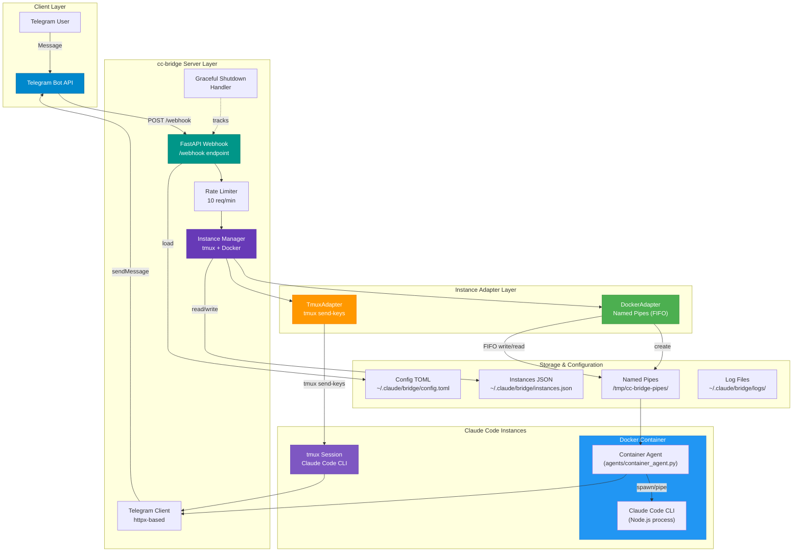
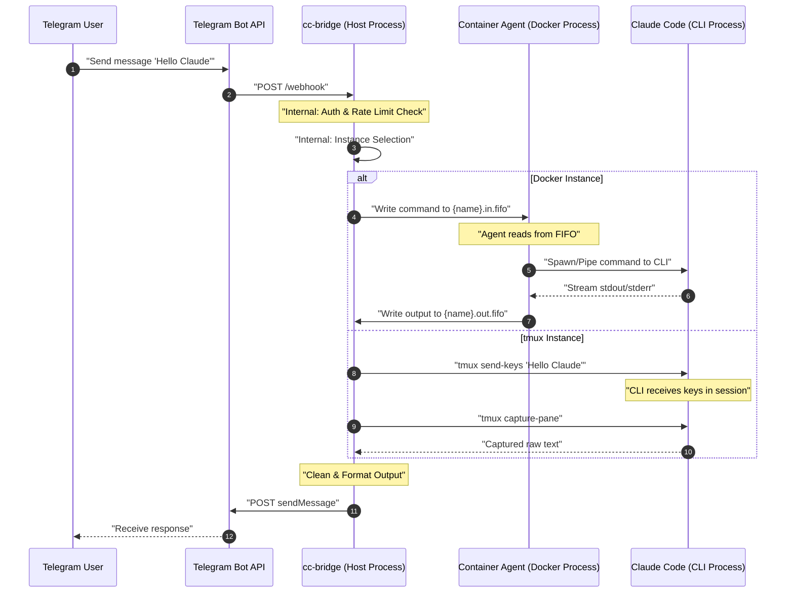

# cc-bridge 🚀

**cc-bridge** is a robust Telegram bot bridge for [Claude Code](https://github.com/anthropics/claude-code), enabling you to interact with your AI agent directly from your phone or any Telegram client.

It supports both local **tmux** sessions and **Docker** containers, featuring a high-performance FastAPI server that handles bidirectional communication with low latency.

## Architecture Overview



## Request/Response Sequence Diagram (Inter-Process)



## ✨ Features

- 📱 **Telegram Integration**: Full control of Claude Code via Telegram webhooks.
- 🐳 **Docker FIFO Mode**: Persistent daemon mode with named pipes for low-latency communication.
- 🔄 **Session Tracking**: Conversation history and context persistence across requests.
- 🏥 **Health Monitoring**: Automatic crash recovery and health checks for daemon instances.
- 🔄 **Backward Compatible**: Legacy exec mode support for existing deployments.
- 🪟 **Tmux Support**: Seamless integration with local tmux sessions.
- 🔍 **Auto-Discovery**: Automatically detects running Docker containers via labels.
- ⚡ **YOLO Mode**: Pre-configured "Always-YOLO" settings (auto-trust, disabled cost warnings).
- 🛠️ **CLI First**: Powerful command-line interface for managing instances, tunnels, and configuration.
- 🏗️ **FastAPI Backend**: Efficient, asynchronous architecture with graceful shutdown and rate limiting.
- 🔒 **Security**: Chat ID authorization, rate limiting, input sanitization, and request size limits.
- 🌐 **Cloudflare Tunnel**: Optional tunnel support for remote access without port forwarding.

## 📁 Project Structure

```
cc-bridge/
├── cc_bridge/
│   ├── __init__.py              # Package init (v0.1.0)
│   ├── cli.py                   # Typer CLI entry point
│   ├── config.py                # Configuration management (TOML + env)
│   ├── logging.py               # Structlog logging setup
│   ├── constants.py             # Application constants
│   ├── exceptions.py            # Custom exceptions
│   │
│   ├── agents/
│   │   └── container_agent.py   # Docker container agent (FIFO communication)
│   │
│   ├── commands/
│   │   ├── server.py            # FastAPI webhook server
│   │   ├── claude.py            # Claude instance commands (start/stop/attach)
│   │   ├── hook_stop.py         # Stop hook for sending responses
│   │   ├── setup.py             # Interactive setup wizard
│   │   ├── config.py            # Config management command
│   │   ├── health.py            # Health check command
│   │   ├── tunnel.py            # Cloudflare tunnel management
│   │   ├── docker_cmd.py        # Docker commands
│   │   ├── cron.py              # Cron job management
│   │   ├── bot.py               # Bot commands
│   │   └── logs.py              # Log viewing
│   │
│   ├── core/
│   │   ├── instances.py         # Instance lifecycle management
│   │   ├── instance_interface.py  # Adapter interface + factory
│   │   ├── tmux.py              # tmux session integration
│   │   ├── docker_compat.py     # Docker SDK wrapper
│   │   ├── docker_discovery.py  # Auto-discovery by label
│   │   ├── docker_errors.py     # Docker error handling
│   │   ├── telegram.py          # Telegram API client (httpx, retry logic)
│   │   ├── named_pipe.py        # FIFO pipe communication
│   │   ├── claude.py            # Claude Code CLI integration
│   │   ├── validation.py        # Input validation utilities
│   │   ├── instance_detector.py # Instance detection
│   │   └── parser.py            # Output parsing
│   │
│   └── models/
│       ├── config.py            # Config data models
│       ├── instances.py         # Instance data models
│       └── telegram.py          # Telegram update models
│
├── scripts/
│   ├── install-service.sh       # LaunchAgent installer (macOS)
│   ├── uninstall-service.sh     # LaunchAgent uninstaller
│   ├── install-daemon.sh        # LaunchDaemon installer (root)
│   ├── uninstall-daemon.sh      # LaunchDaemon uninstaller
│   ├── health-check.sh          # Health check script
│   └── test_pipes.py            # Named pipe testing
│
├── tests/                       # pytest tests
│   ├── test_cli.py
│   ├── test_commands/
│   └── test_core/
│
├── Makefile                     # Make targets
├── pyproject.toml              # Project configuration
└── README.md                   # This file
```

## 🚀 Quick Start

### 1. Installation

```bash
# Clone the repository
git clone https://github.com/robinmin/cc-bridge
cd cc-bridge

# Install dependencies using uv
uv sync

# Or with make (interactive setup)
make bridge-setup
```

### 2. Configuration

Run the interactive setup wizard:

```bash
cc-bridge setup
```

Or manually edit `~/.claude/bridge/config.toml`:

```toml
[telegram]
bot_token = "123456:ABC-DEF1234..."
chat_id = 123456789
webhook_url = "https://your-domain.com/webhook"

[server]
host = "0.0.0.0"
port = 8080

[docker]
enabled = true
network = "claude-network"
preferred = false
auto_discovery = true

[logging]
level = "INFO"
format = "json"
file = "~/.claude/bridge/logs/bridge.log"
```

### 3. Start a Claude Instance

```bash
# Docker instance (recommended)
cc-bridge claude start my-project --type docker

# tmux instance
cc-bridge claude start my-project --type tmux
```

### 4. Start the Bridge Server

```bash
# Development mode with auto-reload
make bridge-dev

# Or production mode
cc-bridge server
```

### 5. Set Up Webhook (Optional)

For local development, use Cloudflare tunnel:

```bash
# Start tunnel
cc-bridge tunnel --start

# Set webhook via Telegram API
curl -X POST "https://api.telegram.org/bot<TOKEN>/setWebhook?url=https://your-tunnel-url.ngrok.io/webhook"
```

## 📖 Usage

### Server Commands

```bash
# Start server with auto-reload
cc-bridge server --reload

# Start server on specific port
cc-bridge server --host 0.0.0.0 --port 9000

# Health check
cc-bridge health
# Or: curl http://localhost:8080/health
```

### Instance Management

```bash
# List all instances
cc-bridge claude-list

# Start a new instance
cc-bridge claude start my-session

# Attach to a running instance
cc-bridge claude-attach my-session

# Restart an instance
cc-bridge claude-restart my-session

# Stop an instance
cc-bridge claude-stop my-session
```

### Docker Commands

```bash
# List Docker instances
cc-bridge docker list

# Create a Docker instance
cc-bridge docker create my-container

# Stop a Docker instance
cc-bridge docker stop my-container
```

### Tunnel Management

```bash
# Start Cloudflare tunnel
cc-bridge tunnel --start

# Stop tunnel
cc-bridge tunnel --stop

# Set auto-start on boot
cc-bridge config tunnel.auto_start true
```

### Configuration Management

```bash
# Get config value
cc-bridge config server.port

# Set config value
cc-bridge config server.port 9000

# Delete config value
cc-bridge config server.port --delete
```

## 🔄 Migration from Exec to FIFO Mode

If you're upgrading from an older version using exec mode, see the [Migration Guide](docs/migration-guide.md) for step-by-step instructions.

**Quick summary:**
1. Update `~/.config/cc-bridge/config.yaml` with `communication_mode: fifo`
2. Create pipe directory: `mkdir -p /tmp/cc-bridge/pipes`
3. Restart cc-bridge
4. Recreate instances with FIFO mode

See [FIFO Mode Documentation](docs/fifo-mode.md) for detailed configuration options.

## 🛠️ Development

### Make Targets

| Target | Description |
|--------|-------------|
| `make help` | Show all available commands |
| `make bridge-status` | Run system health check |
| `make bridge-setup` | Interactive setup wizard |
| `make env-install` | Install dependencies using uv |
| `make bridge-dev` | Start development server with auto-reload |
| `make code-test` | Run pytest with coverage |
| `make code-test-quick` | Run tests without coverage |
| `make code-lint` | Run ruff linter |
| `make code-format` | Format code with ruff |
| `make code-typecheck` | Run ty type checker |
| `make code-fix` | Auto-fix lint errors + format code |
| `make code-all` | Run all checks (lint, format, typecheck, test) |
| `make code-fix-all` | Auto-fix everything, then validate |
| `make dist-build` | Build distribution packages |
| `make dist-clean` | Clean build artifacts |

### Running Tests

```bash
# Run all tests with coverage
make code-test

# Run specific test file
uv run pytest tests/test_core/test_instances.py -v

# Run with coverage HTML report
uv run pytest --cov=cc_bridge --cov-report=html
```

### Code Quality

```bash
# Check code quality
make code-lint
make code-typecheck

# Auto-fix issues
make code-fix
```

## 🏗️ Architecture Details

### Communication Modes

cc-bridge supports two communication modes for Docker instances:

#### FIFO Mode (Daemon Mode - Recommended)

**FIFO mode** uses persistent background processes with named pipes for communication:

- Lower latency and overhead
- Session tracking and persistence
- Built-in health monitoring and recovery
- Single persistent process per container

How it works:
1. A persistent `container_agent.py` runs inside the container
2. Two named pipes are created on the host:
   - `{instance}.in.fifo` - Host writes commands, container reads
   - `{instance}.out.fifo` - Container writes responses, host reads
3. The agent reads commands, executes via Claude Code CLI, and streams output

Configuration:
```yaml
docker:
  communication_mode: fifo  # Daemon mode (default)
  pipe_dir: /tmp/cc-bridge/pipes
```

See [FIFO Mode Documentation](docs/fifo-mode.md) for details.

#### Exec Mode (Legacy)

**Exec mode** uses one-shot `docker exec` commands for each request:

- Simple but higher overhead
- No session persistence
- No background health monitoring

Configuration:
```yaml
docker:
  communication_mode: exec  # Legacy mode
```

Both modes can coexist, and you can specify the mode per instance when adding:
```bash
cc-bridge docker add my-instance --mode fifo
cc-bridge docker add my-instance --mode exec
```

### tmux (Direct Integration)

For tmux sessions, cc-bridge uses:
- `tmux send-keys` to inject commands
- `tmux capture-pane` to retrieve output
- Session tracking via `tmux list-sessions`

### Component Responsibilities

| Component | Responsibility |
|-----------|---------------|
| `FastAPI Server` | Receive webhooks, rate limiting, request routing |
| `TelegramClient` | API communication with retry logic |
| `InstanceManager` | Instance lifecycle, status caching, discovery |
| `TmuxAdapter` | tmux session communication |
| `DockerAdapter` | Named pipe communication with containers |
| `ContainerAgent` | In-container CLI execution |
| `Config` | Layered configuration (defaults → file → env → CLI) |

## 🔌 API Reference

### Webhook Endpoint

**POST** `/webhook`

Receives Telegram updates and forwards to Claude Code.

**Request Body:**
```json
{
  "update_id": 123456789,
  "message": {
    "message_id": 1,
    "from": {"id": 123456789, "first_name": "User"},
    "chat": {"id": 123456789, "type": "private"},
    "text": "Hello Claude"
  }
}
```

**Response:**
```json
{"status": "ok"}
```

**Rate Limits:** 10 requests per minute per chat_id

### Health Endpoint

**GET** `/health`

Returns server health and instance status.

**Response:**
```json
{
  "status": "healthy",
  "uptime_seconds": 3600.5,
  "instances": {
    "total": 2,
    "running": 1,
    "stopped": 1,
    "tmux": 1,
    "docker": 1
  },
  "pending_requests": 0,
  "version": "0.1.0"
}
```

## 🔧 Service Management

### LaunchAgent (starts at login - recommended)

```bash
# Install service
make agent-setup

# Control service
make agent-start      # Start service
make agent-stop       # Stop service
make agent-restart    # Restart service
make logs-monitor    # View logs (tail -f)

# Uninstall
make agent-uninstall
```

### System Gateway (starts at boot - for servers)

```bash
# Install gateway
make gateway-setup

# Control gateway
make gateway-start     # Start gateway
make gateway-stop      # Stop gateway
make gateway-restart   # Restart gateway

# Uninstall
make gateway-uninstall
```

## 📊 Configuration Reference

### Telegram Settings

| Option | Type | Default | Description |
|--------|------|---------|-------------|
| `telegram.bot_token` | string | - | Bot token from @BotFather |
| `telegram.chat_id` | int | - | Authorized chat ID |
| `telegram.webhook_url` | string | - | Webhook URL |

### Server Settings

| Option | Type | Default | Description |
|--------|------|---------|-------------|
| `server.host` | string | `0.0.0.0` | Server host |
| `server.port` | int | `8080` | Server port |
| `server.reload` | bool | `false` | Enable auto-reload |

### Docker Settings

| Option | Type | Default | Description |
|--------|------|---------|-------------|
| `docker.enabled` | bool | `true` | Enable Docker support |
| `docker.communication_mode` | string | `fifo` | Communication mode: `fifo` (daemon) or `exec` (legacy) |
| `docker.network` | string | `claude-network` | Docker network name |
| `docker.preferred` | bool | `false` | Prefer Docker over tmux |
| `docker.auto_discovery` | bool | `true` | Auto-discover containers |
| `docker.pipe_dir` | string | `/tmp/cc-bridge/pipes` | Named pipe directory (FIFO mode) |
| `docker.session.idle_timeout` | int | `300` | Session idle timeout in seconds |
| `docker.session.request_timeout` | int | `120` | Request timeout in seconds |
| `docker.session.max_history` | int | `100` | Max conversation turns to keep |
| `docker.health.enabled` | bool | `true` | Enable health monitoring (FIFO mode) |
| `docker.health.check_interval` | int | `30` | Health check interval in seconds |
| `docker.health.max_consecutive_failures` | int | `3` | Failures before recovery |
| `docker.health.recovery_delay` | int | `5` | Seconds before recovery attempt |

### Logging Settings

| Option | Type | Default | Description |
|--------|------|---------|-------------|
| `logging.level` | string | `INFO` | Log level |
| `logging.format` | string | `json` | Log format (json/text) |
| `logging.file` | string | `~/.claude/bridge/logs/bridge.log` | Log file path |
| `logging.max_bytes` | int | `10485760` | Max log size (10MB) |
| `logging.backup_count` | int | `5` | Number of backups |

## 🔒 Security Features

1. **Chat ID Authorization**: Only configured chat IDs can interact
2. **Rate Limiting**: 10 requests per minute per chat
3. **Request Size Limits**: Maximum request size enforced
4. **Input Sanitization**: HTML escaping for Telegram messages
5. **Instance Name Validation**: Security checks on instance names
6. **Timeout Handling**: Configurable timeouts for all operations

## 🐛 Troubleshooting

### Instance not responding

```bash
# Check instance status
cc-bridge claude-list

# Check health
cc-bridge health

# View logs
make logs-monitor
```

### Docker container not discovered

```bash
# Ensure container has the correct label
docker inspect my-container | grep cc-bridge

# Manually refresh discovery
cc-bridge docker refresh
```

### Webhook not receiving messages

```bash
# Check webhook is set
curl https://api.telegram.org/bot<TOKEN>/getWebhookInfo

# Verify tunnel is running
cc-bridge tunnel status
```

### Port already in use

```bash
# Check what's using port 8080
lsof -ti :8080

# Kill the process
lsof -ti :8080 | xargs kill -9
```

### UV Virtual Environment Mismatch

If you see warnings about `VIRTUAL_ENV` mismatch from `uv`, ensure you are using the latest `Makefile` which automatically unsets the variable to target the local `.venv`:

```bash
# Typical warning:
# warning: `VIRTUAL_ENV=...` does not match the project environment path `.venv`
```

The `make` targets are designed to be environment-agnostic.

## 📄 License

MIT © [Robin Min](mailto:robin@example.com)
