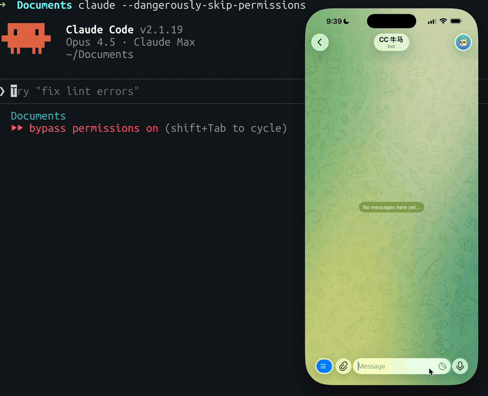
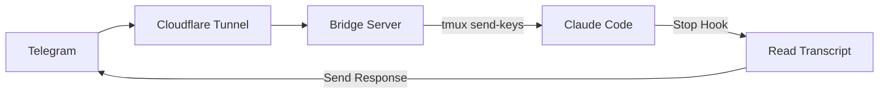

# claudecode-telegram



Telegram bot bridge for Claude Code. Send messages from Telegram, get responses back.

## How it works



1. Bridge receives Telegram webhooks, injects messages into Claude Code via tmux
2. Claude Code's Stop hook reads the transcript and sends response back to Telegram
3. Only responds to Telegram-initiated messages (uses pending file as flag)

## Install

```bash
# Prerequisites
brew install tmux cloudflared

# Clone
git clone https://github.com/hanxiao/claudecode-telegram
cd claudecode-telegram

# Setup Python env
uv venv && source .venv/bin/activate
uv pip install -e .
```

## Quick Setup

The easiest way to get started is using the interactive setup wizard:

```bash
# Run the setup wizard
cc-bridge setup
```

The setup wizard will guide you through:
1. **Enter your Telegram bot token** (from @BotFather)
2. **Auto-detect your Chat ID** - Send `/start` to your bot, we'll detect it automatically
3. **Start Cloudflare Tunnel** - Automatically starts and extracts the tunnel URL
4. **Auto-generate .env file** - Creates configuration from `.env.example`
5. **Register Webhook** - Automatically configures Telegram webhook
6. **Setup Health Checks** - Optionally configure crontab for automatic monitoring

**No manual configuration needed!** The wizard handles everything.

## Manual Setup

### 1. Create Telegram bot

Bot receives your messages and sends Claude's responses back.

```bash
# Message @BotFather on Telegram, create bot, get token
```

### 2. Configure Stop hook

Hook triggers when Claude finishes responding, reads transcript, sends to Telegram.

```bash
cp hooks/send-to-telegram.sh ~/.claude/hooks/
nano ~/.claude/hooks/send-to-telegram.sh  # set your bot token
chmod +x ~/.claude/hooks/send-to-telegram.sh
```

Add to `~/.claude/settings.json`:
```json
{
  "hooks": {
    "Stop": [{"hooks": [{"type": "command", "command": "~/.claude/hooks/send-to-telegram.sh"}]}]
  }
}
```

### 3. Start tmux + Claude

tmux keeps Claude Code running persistently; bridge injects messages via `send-keys`.

```bash
tmux new -s claude
claude --dangerously-skip-permissions
```

### 4. Run bridge

Bridge receives Telegram webhooks and injects messages into Claude Code.

```bash
## find out the TELEGRAM_BOT_TOKEN
cat ~/.claude/hooks/send-to-telegram.sh|grep 'TELEGRAM_BOT_TOKEN='
export TELEGRAM_BOT_TOKEN="your_token"
python bridge.py
```

### 5. Expose via Cloudflare Tunnel

Tunnel exposes local bridge to the internet so Telegram can reach it.

```bash
cloudflared tunnel --url http://localhost:8080
```

### 6. Set webhook

Tells Telegram where to send message updates.

```bash
export NEW_CF_TUNNEL="https://additions-samba-graph-stake.trycloudflare.com"
curl "https://api.telegram.org/bot${TELEGRAM_BOT_TOKEN}/setWebhook?url=${NEW_CF_TUNNEL}"
```

## Bot Commands

| Command | Description |
|---------|-------------|
| `/status` | Check tmux session |
| `/clear` | Clear conversation |
| `/resume` | Pick session to resume (inline keyboard) |
| `/continue_` | Auto-continue most recent |
| `/loop <prompt>` | Start Ralph Loop (5 iterations) |
| `/stop` | Interrupt Claude |
| `/user_info` | Show your user info (multi-user) |
| `/users` | List all users (admin only) |

## Multi-User Support

The bridge supports multiple users with authentication, session isolation, and access control. See [MULTI_USER.md](MULTI_USER.md) for details.

### Quick Start

1. Enable multi-user mode in `~/.claude/bridge/config.toml`:
   ```toml
   [multi_user]
   enabled = true
   allowed_users = []  # Empty = all users allowed
   admin_users = [123456789]  # Admin chat IDs
   ```

2. Users are automatically created on first message
3. Each user has isolated sessions
4. Admins can manage users via `/users` command

### Features

- **User Authentication**: Automatic user creation and management
- **Session Isolation**: Each user has their own session context
- **Access Control**: Optional allowlist for restricted access
- **User Management**: Admin commands for user oversight
- **Thread-Safe**: Concurrent user operations supported

## CLI Commands

### Setup

Interactive setup wizard for first-time configuration:

```bash
cc-bridge setup
```

This will:
- Prompt for your Telegram bot token
- Verify the token with Telegram API
- Create `~/.claude/bridge/config.toml` configuration file
- Set up tmux session
- Register bot commands with Telegram
- Display next steps

### Health Check

Check the health status of the bridge components:

```bash
# Check all components
cc-bridge health

# Check specific component
cc-bridge health --webhook    # Check Telegram API connectivity
cc-bridge health --tmux       # Check tmux session status
cc-bridge health --hook       # Check hook files
cc-bridge health --token      # Check bot token validity
cc-bridge health --config     # Check configuration
```

**Exit codes:**
- `0` - All checks passed (healthy)
- `1` - One or more checks failed (unhealthy)

### Server

Start the bridge server:

```bash
cc-bridge server
```

This starts the HTTP server that receives Telegram webhooks and forwards messages to Claude Code.

**Example output:**
```
✓ Webhook: Connected (bot: @my_bot)
✓ tmux: Session 'claude' running
✓ Hook: Files present
✓ Config: Loaded from ~/.claude/bridge/config.toml
✓ Bot token: Valid

Overall: Healthy
```

### Config

Configuration management for the bridge:

```bash
# Get a configuration value
cc-bridge config bot_token

# Set a configuration value
cc-bridge config bot_token "new_token"

# Set nested configuration value
cc-bridge config telegram.bot_token "new_token"

# Delete a configuration value
cc-bridge config bot_token --delete

# List all configuration values
cc-bridge config --list

# Edit config file in default editor
cc-bridge config --edit
```

**Supported configuration keys:**

- `bot_token` - Telegram bot token from @BotFather
- `chat_id` - Your Telegram chat ID (auto-detected during setup)
- `tmux_session` - tmux session name (default: `claude`)
- `port` - Bridge server port (default: `8080`)
- `telegram.bot_token` - Bot token (nested)
- `telegram.chat_id` - Chat ID (nested)
- `telegram.webhook_url` - Webhook URL (nested)
- `server.host` - Server host (nested)
- `server.port` - Server port (nested)
- `instances.data_file` - Instance metadata file path (nested)
- `logging.level` - Log level (nested)
- `logging.format` - Log format (nested)
- `logging.file` - Log file path (nested)
- `health.enabled` - Enable health checks (nested)
- `health.interval_minutes` - Health check interval (nested)
- `tunnel.auto_start` - Auto-start tunnel on boot (nested)

**Example:**

```bash
# Set bot token
cc-bridge config bot_token "123456:ABC-DEF1234ghIkl-zyx57W2v1u123ew11"

# Set nested value
cc-bridge config telegram.webhook_url "https://my-tunnel.trycloudflare.com"

# List all values
cc-bridge config --list
# Output:
# Configuration values:
# ----------------------------------------
#   bot_token: 123456:ABC-DEF1234ghIkl-zyx57W2v1u123ew11
#   tmux_session: claude
#   port: 8080
#   telegram.webhook_url: https://my-tunnel.trycloudflare.com
# ----------------------------------------

# Edit config file directly
cc-bridge config --edit
# Opens ~/.claude/bridge/config.toml in your default editor
```

### Claude

Manage Claude Code instances without touching tmux directly:

```bash
# Start a new instance
cc-bridge claude start my-instance

# Start with custom working directory
cc-bridge claude start project-a --cwd ~/projects/project-a

# Start and attach immediately
cc-bridge claude start my-instance --no-detach

# List all instances
cc-bridge claude list

# Attach to a running instance
cc-bridge claude attach my-instance

# Stop an instance
cc-bridge claude stop my-instance

# Force stop without confirmation
cc-bridge claude stop my-instance --force

# Restart an instance
cc-bridge claude restart my-instance
```

**Features:**
- **Automatic tmux management** - No need to manually create/attach sessions
- **Working directory support** - Each instance can have its own project folder
- **Instance metadata** - Tracks PID, status, and activity timestamps
- **Status monitoring** - Check if instances are running, stopped, or crashed
- **Safe operations** - Validates paths and handles errors gracefully

**Example output:**

```bash
$ cc-bridge claude start project-a --cwd ~/projects/project-a
✅ Started Claude instance 'project-a'
   Session: claude-project-a
   Working directory: /Users/you/projects/project-a

$ cc-bridge claude list
Found 2 instance(s):

🟢 project-a
   Session: claude-project-a
   Working directory: /Users/you/projects/project-a
   Status: running
   Created: 2025-01-27 14:30

🔴 old-instance
   Session: claude-old-instance
   Working directory: (default)
   Status: stopped
   Created: 2025-01-26 09:15

$ cc-bridge claude attach project-a
Attaching to 'project-a'...
Press Ctrl+B then D to detach.
[Attaches to tmux session...]
```

**Instance Status:**
- 🟢 **running** - Instance is active and responding
- 🔴 **stopped** - Instance process has terminated
- ⚪ **no_pid** - Instance metadata exists but no PID assigned


### Tunnel

Manage Cloudflare tunnel for exposing the local bridge to the internet:

```bash
# Start tunnel (defaults to port 8080)
cc-bridge tunnel-start

# Start tunnel on custom port
cc-bridge tunnel-start --port 3000

# Check tunnel status
cc-bridge tunnel-status

# Stop tunnel
cc-bridge tunnel-stop
```

**Tunnel start** automatically:
1. Starts `cloudflared` process
2. Extracts the quick tunnel URL
3. Sets Telegram webhook to the tunnel URL
4. Saves tunnel state for status checking

**Example output:**
```
  Starting Cloudflare tunnel...
  Waiting for tunnel URL...
  cloudflared: https://abc123.trycloudflare.com
✓ Tunnel started: https://abc123.trycloudflare.com
  Setting Telegram webhook...
✓ Telegram webhook set

Tunnel is running. Press Ctrl+C to stop.
```

**Prerequisites:**
- Install `cloudflared`: `brew install cloudflared`
- Bot token must be configured (run `cc-bridge setup`)

### Webhook

Manage Telegram webhooks manually:

```bash
# Set webhook URL
cc-bridge webhook set https://example.com/webhook

# Test webhook connectivity (tests current webhook or specific URL)
cc-bridge webhook test
cc-bridge webhook test https://example.com/webhook

# Get current webhook information
cc-bridge webhook info

# Delete webhook
cc-bridge webhook delete
```

**Webhook set** configures Telegram to send updates to your specified URL.

**Webhook test** verifies that your webhook URL is reachable.

**Webhook info** displays:
- Current webhook URL
- Pending update count
- Last error message (if any)

**Webhook delete** removes the webhook configuration.

**Example output:**
```
cc-bridge webhook set https://example.com/webhook
  Setting webhook to https://example.com/webhook...
✓ Webhook set to https://example.com/webhook

cc-bridge webhook test
  Testing webhook connectivity to https://example.com/webhook...
✓ Webhook test successful

cc-bridge webhook info
  Getting webhook info...
Current webhook: https://example.com/webhook
Pending updates: 0
Last error: None

cc-bridge webhook delete
  Deleting webhook...
✓ Webhook deleted
```

## Docker Deployment

### Why Docker?

Docker deployment offers several advantages:
- **Isolated environment** - No dependency conflicts with host system
- **Reproducible builds** - Same environment across development and production
- **Easy deployment** - Single command to start the entire stack
- **Health monitoring** - Built-in health checks and automatic restarts
- **Log management** - Centralized logging with rotation

### Quick Start with Docker Compose

The easiest way to run the bridge in production is using Docker Compose:

```bash
# 1. Copy environment file
cp .env.example .env

# 2. Edit .env and set your TELEGRAM_BOT_TOKEN
nano .env

# 3. Start the container
docker-compose up -d

# 4. Check logs
docker-compose logs -f cc-bridge

# 5. Check health status
docker-compose ps

# 6. Stop the container
docker-compose down
```

### With Cloudflare Tunnel (Public Exposure)

```bash
# Start with tunnel profile
docker-compose --profile tunnel up -d

# Get tunnel URL from logs
docker-compose logs cloudflared | grep trycloudflare.com
```

### Manual Docker Build

```bash
# Build image
docker build -t cc-bridge:latest .

# Run container
docker run -d \
  --name cc-bridge \
  --restart unless-stopped \
  -p 8080:8080 \
  -e TELEGRAM_BOT_TOKEN="your_token" \
  -v $(pwd)/config:/home/bridge/.claude/bridge \
  -v $(pwd)/logs:/home/bridge/.claude/bridge/logs \
  -v ~/.claude:/home/bridge/.claude \
  cc-bridge:latest

# View logs
docker logs -f cc-bridge

# Stop container
docker stop cc-bridge
docker rm cc-bridge
```

### Docker Health Checks

The container includes built-in health checks:

```bash
# Check health status
docker ps
# HEALTHY status appears under STATUS column

# Inspect health check details
docker inspect cc-bridge | jq '.[0].State.Health'

# View health check logs
docker inspect cc-bridge | jq '.[0].State.Health.Log'
```

**Health check configuration:**
- Interval: 30 seconds
- Timeout: 10 seconds
- Start period: 5 seconds
- Retries: 3

### Multi-Stage Build

The Dockerfile uses a multi-stage build for optimization:

**Stage 1 (Builder):**
- Installs build dependencies (gcc)
- Copies project files
- Installs Python packages

**Stage 2 (Runtime):**
- Installs runtime dependencies only (tmux, curl)
- Copies Python packages from builder
- Creates non-root user
- Sets up health checks

**Benefits:**
- Smaller final image size (no build tools)
- Improved security (non-root user)
- Faster deployments (cached layers)

### Volume Mounts

| Volume | Purpose | Host Path | Container Path |
|--------|---------|-----------|----------------|
| Configuration | Persist bot token and settings | `./config` | `/home/bridge/.claude/bridge` |
| Logs | Store bridge logs | `./logs` | `/home/bridge/.claude/bridge/logs` |
| Claude Config | Mount Claude Code directory | `~/.claude` | `/home/bridge/.claude` |

### Docker Compose Profiles

The `docker-compose.yml` supports profiles for different deployment scenarios:

**Default (bridge only):**
```bash
docker-compose up -d
```

**With tunnel (public exposure):**
```bash
docker-compose --profile tunnel up -d
```

### Environment Variables in Docker

All environment variables can be set via:
1. `.env` file (recommended)
2. `docker-compose.yml` environment section
3. `docker run -e` flag

**Example:**
```bash
# Via .env file
echo "PORT=3000" >> .env

# Via docker-compose.yml
environment:
  - PORT=3000

# Via docker run
docker run -e PORT=3000 cc-bridge:latest
```

### Production Considerations

**Security:**
- Container runs as non-root user (UID 1000)
- No sensitive data in image (use env vars/secrets)
- Health checks for monitoring
- Log rotation prevents disk overflow

**Networking:**
- Default bridge network isolation
- Port 8080 exposed to host
- Cloudflare tunnel for public exposure

**Persistence:**
- Configuration stored in mounted volume
- Logs stored in mounted volume
- Session data in Claude Code directory

### Troubleshooting Docker

**Container won't start:**
```bash
# Check logs
docker-compose logs cc-bridge

# Verify environment variables
docker-compose config

# Check if port is in use
lsof -i :8080
```

**Health check failing:**
```bash
# Check container status
docker ps

# Inspect health check
docker inspect cc-bridge | jq '.[0].State.Health'

# Test endpoint manually
curl http://localhost:8080/
```

**Permission issues with volumes:**
```bash
# Fix volume permissions
sudo chown -R 1000:1000 ./config ./logs

# Or run as root (not recommended)
# Remove USER bridge from Dockerfile
```

### Environment Variables

| Variable | Default | Description |
|----------|---------|-------------|
| `TELEGRAM_BOT_TOKEN` | required | Bot token from BotFather |
| `TMUX_SESSION` | `claude` | tmux session name |
| `PORT` | `8080` | Bridge port |
| `LOG_LEVEL` | `INFO` | Logging level |
| `CLAUDE_CONFIG_DIR` | `~/.claude` | Claude Code config path |
# cc-bridge
