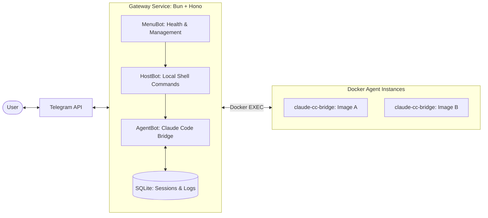

# cc-bridge (Kirin) 🛰️

**cc-bridge** (codenamed **Kirin**) is a high-performance, TypeScript-native Telegram bridge for [Claude Code](https://github.com/anthropics/claude-code). It allows you to interact with your AI agents directly from your favorite Telegram client with absolute reliability and rich visual feedback.

Powered by **Bun** and **Hono**, it replaces the original Python implementation with a modern, event-driven architecture designed for multi-workspace scalability.

---

## 🏗️ Architecture: Chain of Bots

Kirin uses a unique **Chain of Bots** model, where messages bubble through a processing pipeline. Each bot can either handle a message or delegate it down the chain.



---

## ✨ Key Features

- ⚛️ **TSX Component Reporting**: Diagnostics and workspace lists are rendered using a modern TSX component engine for perfect formatting in both Terminal and Telegram.
- 🐳 **Docker-EXEC Streaming**: Robust, low-latency bidirectional communication with agent containers using the Docker SDK—no more brittle named pipes.
- 🗃️ **Persistence & History**: Full SQLite-backed storage for message history, sticky sessions, and proactive task scheduling.
- 📅 **Infrastructure Stability**:
  - **Daily Log Rotation**: Automatic rotation via `pino-roll` to keep your system clean.
  - **Workspace Logging**: Every log is tagged with its workspace name (`[Agent:cc-bridge]`) for seamless debugging.
- 🏥 **High-Fidelity Health Checks**: Real-time monitoring of environment variables, filesystem health, daemon status, and live Docker container stats.
- 🌐 **Content Negotiation**: Serverside rendering that intelligently provides JSON for APIs or human-readable reports for humans based on `Accept` headers.

---

## 🚀 Quick Start

### 1. Requirements
- **Bun** (v1.1+)
- **Docker** (for agent instances)
- **macOS** (for standardized LaunchDaemon support)

### 2. Installation
```bash
# Clone the repository
git clone https://github.com/robinmin/cc-bridge
cd cc-bridge

# Install dependencies
bun install
```

### 3. Setup
Kirin uses **JSONC** for configuration. Create your local config at `data/config/gateway.jsonc`:
```jsonc
{
  "port": 8080,
  "logLevel": "debug",
  "logFormat": "text" // Set to "json" for production
}
```

Ensure `TELEGRAM_BOT_TOKEN` is exported in your environment.

### 4. Running the Service
```bash
# Start the gateway in development mode
make gateway-restart

# Check health
make bridge-status
```

---

## 📱 Telegram Commands

Consolidated and streamlined for version 0.2.0:

- `/status` - **System Health**: Infrastructure, Docker containers, and environment status.
- `/ws_list` - **Workspaces**: List all available project workspaces and their current status.
- `/ws_switch <name>` - **Switch Context**: Instantly switch your chat's active workspace.
- `/ws_status` - **Current Status**: Check the status of your currently active workspace.
- `/help` - **Help Menu**: Detailed list of available commands.

---

## 🛠️ Developer Interface (Makefile)

| Target | Description |
|--------|-------------|
| `make bridge-status` | Comprehensive TSX health report (Terminal) |
| `make gateway-start` | Start the Kirin gateway service |
| `make gateway-stop` | Stop the gateway service |
| `make gateway-restart` | Clean restart with port clearing |
| `make logs-monitor` | Real-time log monitor with workspace tags |
| `make check` | Run lightning-fast Biome linting and formatting |

---

## 📁 Project Structure

```bash
src/
├── gateway/         # The Kirin Hono service
│   ├── routes/      # API endpoints (Health, Webhook)
│   ├── output/      # TSX Rendering Components
│   ├── pipeline/    # Bots Chain (Menu, Host, Agent)
│   └── persistence/ # SQLite & Session Management
├── agent/           # The Dockerized container agent
└── packages/        # Shared internal modules (Logger, Config, IPC)
data/                # (Ignored) Shared volumes
├── logs/            # Daily rotated combined logs
├── ipc/             # Mailbox for proactive messaging
└── gateway.db       # Persistence store
```

---

## 📄 License
MIT © [Robin Min](https://github.com/robinmin)
