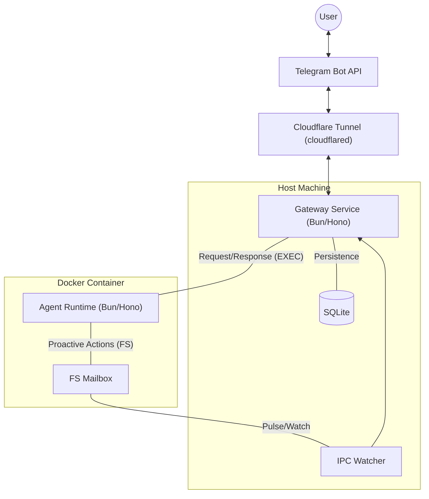
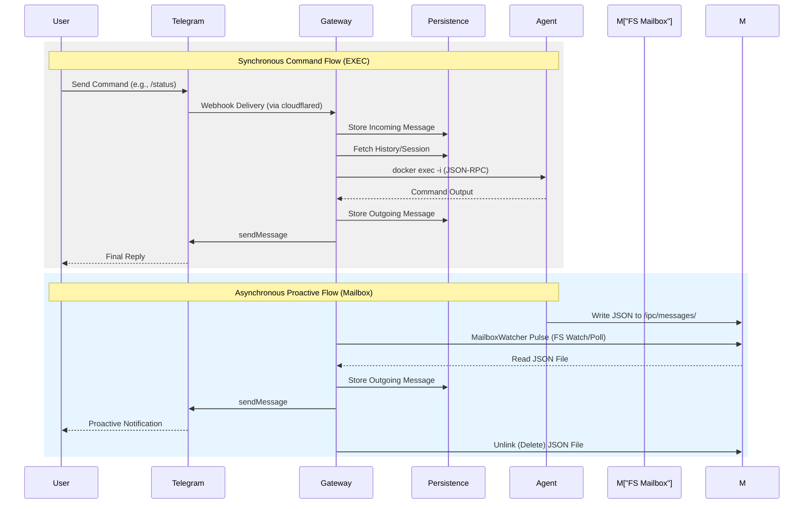

# Container Agent Architecture Specification

## 1. Executive Summary

This document defines the architectural specification for the `cc-bridge` system. The architecture has evolved into a decoupled, service-oriented design featuring a **Gateway Service** and a **Container Agent**.

The system prioritizes high-performance command execution alongside proactive agent capabilities, utilizing a **Hybrid IPC Model** and a **Persistence Layer** for long-running state management.

---

## 2. System Architecture

### 2.1 Hybrid IPC Model

To balance low-latency user interaction with asynchronous proactive capabilities, we use a hybrid transport:

1.  **Request-Response Mode (Exec)**:
    - **Mechanism**: `docker exec -i` with JSON-RPC over `stdin`/`stdout`.
    - **Usage**: Real-time user commands, immediate agent feedback.
    - **Advantage**: Bypasses macOS filesystem synchronization latency for critical paths.

2.  **Bi-directional Mailbox Mode (File-based)**:
    - **Mechanism**: JSON files written to a shared bind-mounted directory (`/workspace/ipc`).
    - **Usage**: Proactive messages, task scheduling, cross-chat coordination.
    - **Advantage**: Overcomes macOS Named Pipe (FIFO) limitations while allowing the agent to "push" events to the host.

### 2.2 Interaction Flows

---

## 3. Core Components

### 3.0 Ingress (External)
- **Telegram Bot API**: Primary user interface for messaging and command input.
- **Cloudflare Tunnel (cloudflared)**: Securely tunnels Telegram webhooks to the local Gateway Service.

### 3.1 Gateway Service
- **Runtime**: Bun + Hono.
- **Message Pipeline**: "Chain of Bots" (MenuBot, HostBot, AgentBot) for request routing.
- **Deduplication & Rate Limiting**: In-memory trackers to ensure system stability.

### 3.2 Persistence Layer (Phase 2)
- **Engine**: SQLite.
- **Schema**:
    - `messages`: Full conversation history for context-aware prompting.
    - `sessions`: Mapping of Chat IDs to Agent Sessions.
    - `tasks`: Scheduled proactive prompts (Cron/Interval).
    - `agents`: Metadata for discovered Docker instances.

### 3.3 Container Agent
- **Runtime**: Bun-based agent wrapper.
- **Capabilities**: Full access to Claude Code SDK, file system operations, and IPC messaging.

---

## Concepts

### Workspace
A **Workspace** is the primary unit of management. It encapsulates:
- A host-side project directory (e.g., `/Users/robin/xprojects/cc-bridge`)
- A dedicated Docker container (managed as a Workspace)
- Isolated IPC Mailbox paths (`data/ipc/<workspace_name>/`)
- Persistence sticky-sessions mapping users to specific workspaces.

---

## 4. Advanced Features

### 4.1 Context-Aware Prompting
Instead of sending single messages, the Gateway reconstructs conversation history from the Persistence Layer, wrapping it in a structured XML format (`<messages>`) for the agent.

### 4.2 Proactive Task Scheduling
Agents can schedule their own future executions by writing task definitions to the Mailbox. The Gateway's scheduler then triggers the agent at the designated time.

### 4.3 Multi-Channel Extensibility
The `Channel` interface allows the Gateway to support Telegram, Slack, Discord, or custom webhooks with minimal modification to the core pipeline.

---

## 5. Security Model
- **Isolation**: Each agent runs in a dedicated Docker container.
- **Mailbox Scoping**: IPC directories are namespaced by group/chat to prevent cross-chat privilege escalation.
- **Mount Security**: Global memory is mounted as read-only for non-main agent instances.
