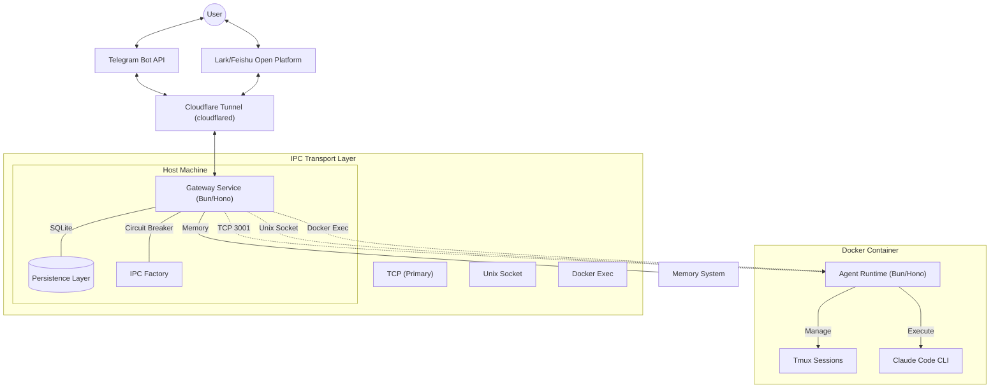
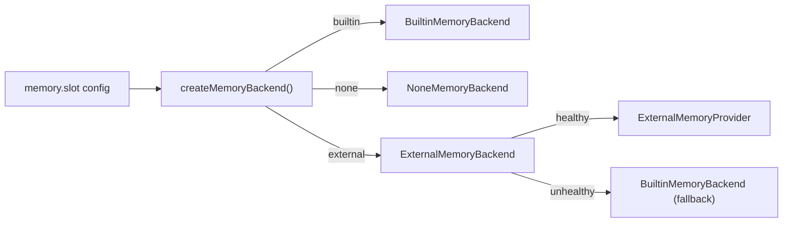

# CC-Bridge Architecture Specification

**Version**: 2.2.0
**Last Updated**: 2026-02-28
**Status**: Production Ready

---

## 1. Executive Summary

CC-Bridge is a **Telegram/Lark-to-Claude Code bridge** built with **Bun/Hono** that enables remote interaction with Claude Code through popular messaging platforms. The system features a **decoupled, service-oriented design** with a **Gateway Service** and **Container Agent**.

### Key Architectural Changes (v2.1)

- **Pluggable Memory System**: Markdown-canonical agent memory with `.memory/SOUL.md`, `.memory/USER.md`, `.memory/MEMORY.md`, and daily `.memory/daily/YYYY-MM-DD.md` files
- **Memory Backend Abstraction**: Slot-based backends (`builtin` | `none` | `external`) with automatic fallback on failure
- **Policy-Driven Prompt Loading**: Context-aware memory injection (private vs group) with configurable overrides
- **Memory Write Triggers**: Automatic capture of durable preferences, decisions, and pre-compaction flush hints
- **Multi-Mode IPC**: Factory pattern supporting TCP, Unix socket, Docker exec, Host, and Remote backends
- **Circuit Breaker**: Resilience pattern with failure tracking and automatic fallback
- **Async Callback Mode**: Tmux-based persistent sessions for long-running operations
- **Enhanced Services Layer**: File cleanup, rate limiting, idempotency, request tracking
- **Plaintext Logging**: Clean log format for better developer experience

---

## 2. System Architecture



### 2.1 IPC Transport Layer

The system uses a **multi-mode IPC architecture** with automatic fallback:

| Method | Latency | Use Case | Priority |
|--------|---------|----------|----------|
| **TCP** | ~10ms | Production (containerized) | 1 |
| **Unix Socket** | ~5ms | Production (host-based) | 2 |
| **Docker Exec** | ~50s | Development fallback | 3 |
| **Host** | ~5ms | No Docker (dev) | - |
| **Remote** | Variable | Distributed systems | - |

### 2.2 Factory Pattern

```typescript
// Auto-select best available IPC method
const client = IpcFactory.create("auto", { instanceName: "cc-bridge" });

// Explicit method selection
const tcpClient = IpcFactory.create("tcp", { instanceName: "cc-bridge" });
const unixClient = IpcFactory.create("unix", { socketPath: "/tmp/agent.sock" });
const dockerClient = IpcFactory.create("docker-exec", { containerId: "abc123" });
```

### 2.3 Circuit Breaker Pattern

All IPC clients are wrapped with a circuit breaker for resilience:


**States:**
- **Closed**: Normal operation, requests pass through
- **Open**: Circuit tripped, requests fail immediately
- **Half-Open**: Testing if service has recovered

### 2.4 Memory System

The gateway includes a **pluggable memory system** that provides durable agent memory across conversations.

**Memory Layers (Source of Truth = Markdown):**

| File | Purpose | Load Context |
|------|---------|-------------|
| `.memory/SOUL.md` | Agent identity, boundaries, communication style | Private + Group |
| `.memory/USER.md` | User profile, stable preferences | Private + Group |
| `.memory/MEMORY.md` | Durable long-term facts/decisions | Private only (by default) |
| `.memory/daily/YYYY-MM-DD.md` | Daily operational memory log | Private only |

**Memory Backend Slots:**

| Slot | Behavior |
|------|----------|
| `none` | Memory disabled; all operations return no-ops |
| `builtin` | Markdown files + local grep-based search |
| `external` | Delegates to an `ExternalMemoryProvider`; falls back to `builtin` on failure |

**Load Policy:**
- **Private/direct contexts**: Load `.memory/SOUL.md`, `.memory/USER.md`, `.memory/MEMORY.md`, today + yesterday daily files
- **Group/shared contexts**: Load `.memory/SOUL.md`, `.memory/USER.md` only (configurable via `groupLoadLongTerm`)

**Write Policy:**
- Explicit intent triggers: "remember this", "I prefer", "always use", "decision:", etc.
- Daily log entries for every conversation turn
- Pre-compaction flush hint when token estimate exceeds threshold



---

## 3. Core Components

### 3.1 Gateway Service

**Runtime**: Bun + Hono
**Entry Point**: `src/gateway/index.ts`

```typescript
// Custom HTTP logging for plaintext format
app.use("*", async (c, next) => {
    const start = Date.now();
    await next();
    const duration = Date.now() - start;
    logger.info(`[${c.req.method}] ${c.req.path} → ${c.res.status} (${duration}ms)`);
});
```

**Bot Pipeline (Chain of Responsibility):**
```typescript
const bots = [
    new MenuBot(telegram),  // Handle slash commands
    new HostBot(telegram),   // Host management commands
    new AgentBot(telegram),  // Claude Code execution
];
```

### 3.2 Container Agent

**Runtime**: Bun + Hono
**Entry Point**: `src/agent/index.ts`

**Modes of Operation:**
```typescript
// TCP Mode (Primary - Production)
AGENT_MODE=tcp AGENT_TCP_PORT=3001

// Unix Socket Mode
AGENT_MODE=server AGENT_SOCKET=/tmp/agent.sock

// Stdio Mode (One-shot)
AGENT_MODE=stdio

// HTTP API Mode (Advanced)
AGENT_MODE=http HTTP_PORT=3000
```

### 3.3 IPC Package

**Location**: `src/packages/ipc/`

**Key Classes:**
- `IpcFactory`: Creates IPC clients based on method
- `TcpIpcClient`: TCP socket communication
- `UnixSocketIpcClient`: Unix domain socket
- `DockerExecIpcClient`: Docker exec fallback
- `HostIpcClient`: No-Docker host mode
- `RemoteIpcClient`: Remote/distributed systems
- `CircuitBreakerIpcClient`: Resilience wrapper
- `StdioIpcAdapter`: Agent-side stdio handler

### 3.4 Services Layer

| Service | Purpose | Location |
|---------|---------|----------|
| **MemoryManager** | Pluggable agent memory (load, write, search) | `src/gateway/memory/manager.ts` |
| **MemoryPolicy** | Context-aware load decisions | `src/gateway/memory/policy.ts` |
| **FileSystemIpc** | Stop hook callbacks | `src/gateway/services/filesystem-ipc.ts` |
| **FileCleanupService** | Response file cleanup | `src/gateway/services/file-cleanup.ts` |
| **IdempotencyService** | Duplicate detection | `src/gateway/services/IdempotencyService.ts` |
| **RateLimitService** | Rate limiting | `src/gateway/services/RateLimitService.ts` |
| **ResponseFileReader** | Secure file reading | `src/gateway/services/ResponseFileReader.ts` |
| **SessionPoolService** | Session management | `src/gateway/services/SessionPoolService.ts` |
| **TmuxManager** | Tmux session handling | `src/gateway/services/tmux-manager.ts` |
| **RequestTracker** | Request correlation | `src/gateway/services/RequestTracker.ts` |

---

## 4. Data Flow

### 4.1 Synchronous Command Flow


### 4.2 Async Callback Flow (Tmux Mode)


---

## 5. Persistence Layer

**Database**: SQLite (`data/gateway.db`)

**Schema:**
```sql
-- Message history with multi-channel and workspace support
CREATE TABLE messages (
    id INTEGER PRIMARY KEY AUTOINCREMENT,
    chat_id TEXT NOT NULL, -- Supports string IDs for Lark/Feishu
    workspace_name TEXT NOT NULL DEFAULT 'cc-bridge',
    sender TEXT NOT NULL,
    text TEXT NOT NULL,
    timestamp DATETIME DEFAULT CURRENT_TIMESTAMP
);

-- Session mapping (chat -> instance)
CREATE TABLE sessions (
    chat_id TEXT PRIMARY KEY,
    instance_name TEXT NOT NULL,
    last_activity DATETIME DEFAULT CURRENT_TIMESTAMP
);

-- Scheduled tasks
CREATE TABLE tasks (
    id TEXT PRIMARY KEY,
    instance_name TEXT NOT NULL,
    chat_id TEXT NOT NULL,
    prompt TEXT NOT NULL,
    schedule_type TEXT NOT NULL,
    schedule_value TEXT NOT NULL,
    next_run DATETIME,
    status TEXT DEFAULT 'active'
);

-- Workspace mapping (multi-user)
CREATE TABLE workspaces (
    chat_id TEXT PRIMARY KEY,
    workspace_name TEXT NOT NULL DEFAULT 'cc-bridge',
    last_updated DATETIME DEFAULT CURRENT_TIMESTAMP
);
```

---

## 6. Docker Integration

### 6.1 Container Discovery

**Label-based discovery:**
```bash
docker ps --filter "label=cc-bridge.workspace" --format "{{json .}}"
```

**Container labels:**
```dockerfile
LABEL cc-bridge.workspace=cc-bridge
```

### 6.2 Docker Compose Configuration

```yaml
services:
  cc-bridge:
    build:
      context: .
      dockerfile: src/dockers/Dockerfile.agent
    environment:
      - AGENT_MODE=tcp
      - AGENT_TCP_PORT=3001
      - ANTHROPIC_AUTH_TOKEN=${ANTHROPIC_AUTH_TOKEN}
    ports:
      - "3001:3001"
    volumes:
      - ./workspaces:/workspaces
    labels:
      - cc-bridge.workspace=cc-bridge
```

---

## 7. Security Model

### 7.1 Input Validation

```typescript
// XML escaping to prevent injection
function escapeXml(text: string): string {
    return text.replace(XML_ESCAPE_REGEX, (char) => XML_ESCAPE_MAP[char]);
}

// Control character filtering
const hasControlChars = /[\x00-\x08\x0B-\x0C\x0E-\x1F\x7F]/.test(text);
```

### 7.2 Rate Limiting

| Type | Limit | Window |
|------|-------|--------|
| Per Workspace | 100 requests | 1 minute |
| Per IP | 200 requests | 1 minute |

### 7.3 File Security

- **Max file size**: 100MB
- **Read retries**: 3 with 100ms delay
- **TTL**: 1 hour with 5-minute cleanup interval

---

## 8. Configuration

### 8.1 Environment Variables

```bash
# Gateway
PORT=8080
LOG_LEVEL=debug
LOG_FORMAT=json

# Agent
AGENT_MODE=tcp
AGENT_TCP_PORT=3001

# Claude
ANTHROPIC_AUTH_TOKEN=sk-ant-xxx
ANTHROPIC_API_KEY=sk-ant-xxx  # Mapped from AUTH_TOKEN

# Services
FILE_CLEANUP_ENABLED=true
ENABLE_TMUX=true
```

### 8.2 Memory Configuration

Add to `data/config/gateway.jsonc`:

```jsonc
{
  "memory": {
    "slot": "builtin",          // "builtin" | "none" | "external"
    "citations": "auto",        // "auto" | "on" | "off"
    "loadPolicy": {
      "groupLoadLongTerm": false // Allow long-term memory in group chats
    },
    "flush": {
      "enabled": true,
      "softThresholdTokens": 4000
    },
    "builtin": {
      "index": { "enabled": true }
    }
  }
}
```

**Workspace filesystem contract** (under each workspace root):
```
<workspace>/
  .memory/
    SOUL.md           # Agent identity
    USER.md           # User profile
    MEMORY.md         # Long-term durable facts
    daily/
      YYYY-MM-DD.md   # Daily operational memory
```

### 8.3 Constants

```typescript
// Gateway Constants
GATEWAY_CONSTANTS = {
    HEALTH: { STATUS_OK: "ok" },
    CONFIG: {
        DEFAULT_PORT: 8080,
        IPC_DIR: "data/ipc",
        CONFIG_FILE: "data/config/gateway.jsonc",
        WORKSPACE_ROOT: path.resolve(".."),
    },
    INSTANCES: {
        LABEL: "cc-bridge.workspace",
        REFRESH_INTERVAL_MS: 30000,
    },
    FILESYSTEM_IPC: {
        BASE_DIR: "/ipc",
        MAX_FILE_SIZE_MB: 100,
        DEFAULT_FILE_TTL_MS: 3600000,
    },
    DEFAULT_CONFIG: {
        memory: {
            slot: "none",            // "builtin" | "none" | "external"
            citations: "auto",       // "auto" | "on" | "off"
            loadPolicy: {
                groupLoadLongTerm: false,
            },
            flush: {
                enabled: true,
                softThresholdTokens: 4000,
            },
        },
    },
    TMUX: {
        SESSION_PREFIX: "claude",
        MAX_SESSIONS_PER_CONTAINER: 10,
        DEFAULT_IDLE_TIMEOUT_MS: 30 * 60 * 1000,
    },
};
```

---

## 9. Logging Format

### 9.1 Plaintext Mode (Development)

```
[GET] /health → 200 (15ms)
[POST] /webhook → 200 (123ms)
[123456] ==> Hello Claude!
[123456] <== Here's your response...
```

### 9.2 JSON Mode (Production)

```json
{
  "level": "info",
  "time": "2025-02-07T10:00:00Z",
  "chatId": 123456,
  "message": "Processing message",
  "text": "Hello Claude!"
}
```

---

## 10. Advanced Features

### 10.1 Workspace Support

Multiple isolated workspaces per user:
```typescript
const workspace = await persistence.getWorkspace(chatId);
await persistence.setWorkspace(chatId, "another-project");
```

### 10.2 Session Pooling

Tmux sessions managed automatically:
```typescript
const sessionPool = new SessionPoolService(tmuxManager, {
    containerId: process.env.AGENT_CONTAINER_ID || "claude-agent",
});
```

### 10.3 Async Execution

Long-running operations via tmux:
```typescript
const result = await executeClaudeViaTmux(
    containerId,
    instanceName,
    prompt,
    { workspace, chatId }
);
// Returns immediately with requestId
```

---

## 11. Performance

| Metric | Value | Notes |
|--------|-------|-------|
| **TCP IPC Latency** | ~10ms | Production mode |
| **Unix Socket Latency** | ~5ms | Host mode |
| **Docker Exec Latency** | ~50s | Fallback only |
| **Max Output Size** | 10MB | Per request |
| **Request Timeout** | 120s | Webhook processing |
| **File Cleanup TTL** | 1 hour | Response files |

---

## 12. Troubleshooting

### 12.1 Common Issues

| Issue | Solution |
|-------|----------|
| IPC timeout | Check `AGENT_MODE=tcp` is set |
| Circuit breaker open | Wait for timeout or reset manually |
| Container not discovered | Verify `cc-bridge.workspace` label |
| Session not found | Check TmuxManager logs |

### 12.2 Debug Commands

```bash
# Check IPC connectivity
make docker-talk msg="ping"

# View logs
make logs-monitor

# Restart services
make gateway-restart
make docker-restart
```

---

## Document Version History

| Version | Date | Changes |
|---------|------|---------|
| 2.2.0 | 2026-02-28 | Added pluggable memory system (builtin/none/external backends), policy-driven prompt loading, memory write triggers, flush hints |
| 2.1.0 | 2026-02-08 | Added Lark/Feishu integration, enhanced logging, and type standardization |
| 2.0.0 | 2025-02-07 | Major update: IPC factory, circuit breaker, tmux mode, services layer |
| 1.0.0 | 2026-02-02 | Initial architecture specification |

---

**Maintained by**: CC-Bridge Development Team
