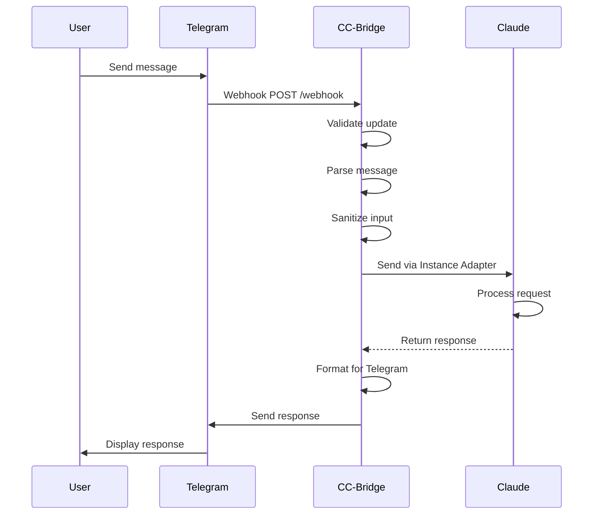
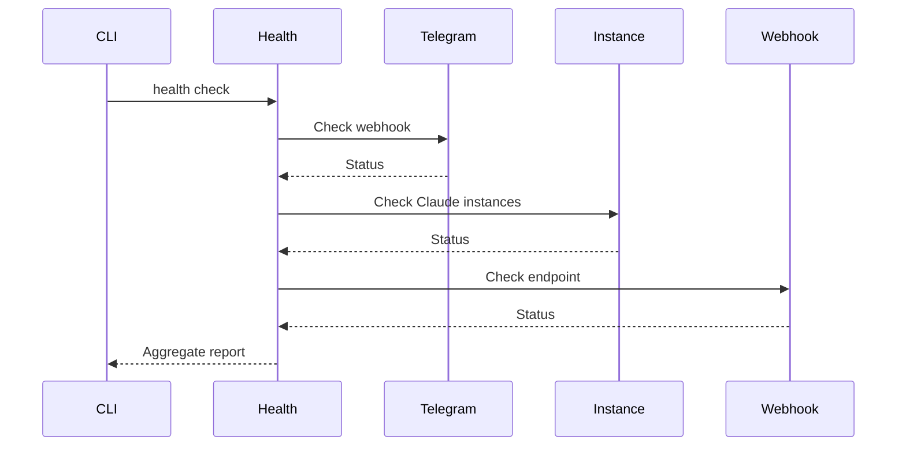

# CC-Bridge Developer Specification

**Version**: 0.1.0
**Last Updated**: 2026-02-02
**Status**: Beta / Production Ready

---

## Table of Contents

1. [Overview](#1-overview)
2. [Architecture](#2-architecture)
3. [System Components](#3-system-components)
4. [Data Flow](#4-data-flow)
5. [Module Reference](#5-module-reference)
6. [API Reference](#6-api-reference)
7. [Testing Strategy](#7-testing-strategy)
8. [Development Workflow](#8-development-workflow)
9. [Maintenance Guide](#9-maintenance-guide)
10. [Extension Guide](#10-extension-guide)

---

## 1. Overview

### 1.1 Purpose

CC-Bridge is a production-ready Python application that bridges Telegram bots with Claude Code CLI. It enables bidirectional communication between Telegram users and Claude Code through:

- **FastAPI Webhook Server**: Receives Telegram updates and handles communication synchronously
- **Instance Management**: Manages Claude Code instances (tmux sessions, Docker containers)
- **Direct Response Handling**: Captures Claude's responses and sends them back to Telegram immediately
- **Health Monitoring**: Ensures all components are functioning correctly

### 1.2 Design Principles

1. **Separation of Concerns**: Clear boundaries between CLI, business logic, and infrastructure
2. **Testability**: Comprehensive test coverage with dependency injection
3. **Configurability**: Layered configuration system for flexibility
4. **Observability**: Structured logging and health checks
5. **Extensibility**: Plugin-style command architecture

### 1.3 Technology Stack

| Component | Technology | Purpose |
|-----------|-----------|---------|
| CLI Framework | Typer | Command-line interface |
| Web Framework | FastAPI | Async webhook server |
| HTTP Client | httpx | Telegram Bot API calls |
| Config Management | TOML | Configuration files |
| Logging | structlog | Structured logging |
| Testing | pytest | Test framework |
| Type Checking | ty | Static type checking |
| Linting | ruff | Code quality |

---

## 2. Architecture

### 2.1 High-Level Architecture

```
┌─────────────────┐
│   Telegram      │
│     Bot API     │
└────────┬────────┘
         │ Webhook POST
         ▼
┌───────────────────────────────────────────────────────────┐
│              CC-Bridge FastAPI Server                     │
│  ┌────────────────────────────────────────────────────┐  │
│  │  Webhook Endpoint (/webhook)                       │  │
│  │  - Validates update                                │  │
│  │  - Extracts message                                │  │
│  │  - Parses commands                                 │  │
│  └────────────┬───────────────────────────────────────┘  │
│               │                                            │
│  ┌────────────▼───────────────────────────────────────┐  │
│  │  Message Processor                                 │  │
│  │  - Sanitizes input                                  │  │
│  │  - Extracts code blocks                            │  │
│  │  - Formats for Claude                               │  │
│  └────────────┬───────────────────────────────────────┘  │
└───────────────┼──────────────────────────────────────────┘
                │
                │ Send via Instance Adapter
                ▼
┌───────────────────────────────────────────────────────────┐
│              Claude Code Instance                         │
│  ┌────────────────────────────────────────────────────┐  │
│  │  Instance Adapter (tmux/Docker)                    │  │
│  │  - Sends message to instance                       │  │
│  │  - Waits for response                               │  │
│  │  - Captures output                                  │  │
│  └────────────┬───────────────────────────────────────┘  │
│               │                                            │
│  ┌────────────▼───────────────────────────────────────┐  │
│  │  Claude Code                                       │  │
│  │  - Processes request                                │  │
│  │  - Generates response                               │  │
│  └────────────┬───────────────────────────────────────┘  │
└───────────────┼──────────────────────────────────────────┘
                │ Response captured
                ▼
┌───────────────────────────────────────────────────────────┐
│           Response Formatter & Sender                      │
│  ┌────────────────────────────────────────────────────┐  │
│  │  Response Processor                                 │  │
│  │  - Formats Claude's response for Telegram           │  │
│  │  - Handles truncation for long messages             │  │
│  └────────────┬───────────────────────────────────────┘  │
│               │                                            │
│  ┌────────────▼───────────────────────────────────────┐  │
│  │  Telegram Client                                    │  │
│  │  - Sends response to user                           │  │
│  │  - Handles errors                                   │  │
│  └────────────┬───────────────────────────────────────┘  │
└───────────────┼──────────────────────────────────────────┘
                │ sendMessage API
                ▼
┌─────────────────┐
│   Telegram      │
│   User Receives │
│     Response    │
└─────────────────┘
```

### 2.2 Module Architecture

```
├── agents/                   # Special purpose agents
│   └── container_agent.py    # Bridge agent running inside Docker
├── cli.py                    # Main CLI entry point
├── config.py                 # Configuration management
├── logging.py                # Logging setup
├── commands/                 # CLI command implementations
│   ├── server.py            # FastAPI server command
│   ├── claude.py            # Claude instance management
│   ├── health.py            # Health checks
│   ├── setup.py             # Setup wizard
│   ├── config.py            # Config management command
│   ├── tunnel.py            # Cloudflare tunnel
│   ├── bot.py               # Bot commands sync
│   └── logs.py              # Log streaming
├── core/                     # Business logic
│   ├── telegram.py          # Telegram API client with HTML escaping
│   ├── instances.py         # Instance manager (sync/async)
│   ├── instance_interface.py # Abstract instance adapter
│   ├── docker_compat.py     # Docker SDK wrapper
│   ├── docker_discovery.py  # Label-based discovery
│   ├── tmux.py              # tmux session adapter
│   ├── parser.py            # Message parsing
│   └── validation.py        # Input validation
└── models/                   # Data models
    ├── telegram.py          # Telegram models
    ├── config.py            # Configuration models
    └── instances.py         # Instance data models
```

### 2.3 Sequence Diagrams

#### 2.3.1 Incoming Message Flow



#### 2.3.2 Health Check Flow



---

## 3. System Components

### 3.1 CLI Layer (`cli.py`)

**Responsibility**: Command-line interface and user interaction

**Key Functions**:
- `server()`: Start FastAPI webhook server
- `claude()`: Manage Claude Code instances
- `health()`: Run health checks
- `setup()`: Interactive setup wizard
- `config()`: Configuration management
- `tunnel()`: Cloudflare tunnel management

**Initialization Sequence**:
1. Load configuration from file/env/defaults
2. Setup structured logging
3. Initialize logger instance
4. Register all commands with Typer

### 3.2 Configuration System (`config.py`)

**Responsibility**: Multi-layer configuration management

**Priority Order** (highest to lowest):
1. CLI arguments
2. Environment variables
3. TOML config file (`~/.claude/bridge/config.toml`)
4. Hardcoded defaults

**Key Classes**:
```python
class Config:
    DEFAULTS: dict[str, Any] = {
        "telegram": {"bot_token": "", "webhook_url": ""},
        "server": {"host": "0.0.0.0", "port": 8080, "reload": False},
        "tmux": {"session": "claude", "auto_attach": True},
        "logging": {"level": "INFO", "format": "json", ...},
        "health": {"enabled": True, "interval_minutes": 5},
        "tunnel": {"auto_start": False}
    }

    def get(key: str, default: Any = None) -> Any
    def set(key: str, value: Any) -> None
    def delete(key: str) -> None
    def save() -> None
```

**Environment Variable Mappings**:
- `TELEGRAM_BOT_TOKEN` → `telegram.bot_token`
- `TELEGRAM_WEBHOOK_URL` → `telegram.webhook_url`
- `TMUX_SESSION` → `tmux.session`
- `PORT` → `server.port`
- `LOG_LEVEL` → `logging.level`

### 3.3 Logging System (`logging.py`)

**Responsibility**: Structured logging configuration

**Features**:
- JSON and text formatters
- File rotation (size-based)
- Console and file handlers
- uvicorn log suppression

**Configuration**:
```python
setup_logging(
    level: str = "INFO",
    log_format: str = "json",  # "json" or "text"
    log_file: str | None = None,
    max_bytes: int = 10485760,  # 10MB
    backup_count: int = 5
)
```

**Usage**:
```python
from cc_bridge.logging import get_logger

logger = get_logger(__name__)
logger.info("Message", key="value", user_id=123)
```

### 3.4 Commands Layer (`commands/`)

#### 3.4.1 Server Command (`commands/server.py`)

**FastAPI Application Structure**:
```python
app = FastAPI(title="CC-Bridge Webhook Server")

@app.get("/", response_model=StatusResponse)
async def root() -> StatusResponse:
    """Health check endpoint."""

@app.get("/health", response_model=HealthResponse)
async def health() -> HealthResponse:
    """Detailed health check."""

@app.post("/webhook")
async def webhook(update: Update) -> StatusResponse:
    """Receive Telegram webhook updates."""
```

#### 3.4.2 Webhook Command (`commands/webhook.py`)

**Webhook Management**:
- `set_webhook()`: Register webhook with Telegram
- `get_webhook_info()`: Get current webhook info
- `delete_webhook()`: Remove webhook

#### 3.4.3 Health Command (`commands/health.py`)

**Health Checks**:
- Webhook connectivity
- tmux session status
- Hook functionality
- Configuration validity

#### 3.4.5 Setup Command (`commands/setup.py`)

**Enhanced Interactive Wizard**:

```python
async def run_setup_enhanced() -> Config:
    """
    Enhanced setup wizard with full automation.

    Guides user through:
    1. Telegram bot token input
    2. Automatic chat ID fetching (asks user to send /start)
    3. Cloudflare tunnel startup with URL extraction
    4. Automatic .env file generation
    5. Webhook registration
    6. Crontab configuration (optional)

    Returns:
        Configured Config object
    """


def _generate_env_from_example(
    bot_token: str,
    chat_id: int,
    tunnel_url: str
) -> dict:
    """Generate .env configuration from .env.example."""


async def _fetch_chat_id(bot_token: str) -> int | None:
    """
    Fetch chat ID by asking user to send /start to bot.

    Polls Telegram API for updates and extracts chat ID.
    """


def _setup_crontab() -> bool:
    """Setup crontab for health checks."""


async def _setup_webhook(bot_token: str, tunnel_url: str) -> bool:
    """Setup Telegram webhook."""
```

**Automation Features**:
- **Chat ID Auto-Detection**: Polls Telegram API after user sends `/start`
- **Tunnel URL Parsing**: Extracts URL from `cloudflared` output using regex
- **Environment Generation**: Creates `.env` from `.env.example` template
- **Webhook Registration**: Automatically sets webhook via Telegram API
- **Crontab Setup**: Optionally configures health check automation

**Error Handling**:
- Graceful fallback to manual entry if auto-detection fails
- Rollback on critical failures
- User confirmation for destructive operations

**Setup Flow**:
```
1. Input bot token
       ↓
2. Send /start → Poll API → Extract chat_id
       ↓
3. Start cloudflared → Parse output → Get tunnel URL
       ↓
4. Generate .env file
       ↓
5. Register webhook
       ↓
6. Setup crontab (optional)
       ↓
7. Complete
```

#### 3.4.6 Config Command (`commands/config.py`)

**Configuration Management**:
- View all config: `cc-bridge config`
- Get specific key: `cc-bridge config --key server.port`
- Set value: `cc-bridge config --key server.port --value 9000`
- Delete key: `cc-bridge config --key test.key --delete`

#### 3.4.7 Tunnel Command (`commands/tunnel.py`)

**Enhanced Cloudflare Tunnel Management**:

```python
def parse_tunnel_url(output: str) -> Optional[str]:
    """
    Parse tunnel URL from cloudflared output.

    Uses regex to extract URL like:
    https://abc123.trycloudflare.com
    """


def start_tunnel(port: int = 8080, timeout: int = 30) -> str:
    """
    Start Cloudflare tunnel and return URL.

    Spawns cloudflared process, monitors output for the tunnel URL,
    and returns it once found.

    Raises:
        RuntimeError: If tunnel fails to start or URL not found
    """


def stop_tunnel() -> None:
    """Stop running Cloudflare tunnel."""


async def set_webhook(url: str, bot_token: str) -> bool:
    """Set Telegram webhook to tunnel URL."""
```

**URL Parsing**:
- **Pattern**: `https://[a-z0-9\-]+\.trycloudflare\.com`
- **Method**: Monitors `cloudflared` stdout line-by-line
- **Timeout**: 30 seconds (configurable)
- **Fallback**: Manual URL entry if parsing fails

**Process Management**:
- Spawns `cloudflared tunnel --url http://localhost:{port}`
- Monitors process output asynchronously
- Terminates process on timeout or error
- Finds and kills existing `cloudflared` processes on stop

**Integration**:
- Automatically called by enhanced setup wizard
- Webhook auto-registration after URL extraction
- No manual URL copying required

#### 3.4.8 Bot Command (`commands/bot.py`)

**Telegram Bot Commands**:
- Sync slash commands with Telegram
- Register command descriptions
- Handle command metadata

#### 3.4.9 Claude Command (`commands/claude.py`)

**Instance Management Command**:

The `claude` command provides a user-friendly interface for managing Claude Code instances in tmux sessions, hiding tmux complexity from users.

**Subcommands**:

```python
@app.command()
def start(name: str, cwd: Optional[str] = None, detach: bool = True):
    """Start a new Claude Code instance."""

@app.command()
def stop(name: str, force: bool = False):
    """Stop a Claude Code instance."""

@app.command()
def list():
    """List all Claude Code instances."""

@app.command()
def attach(name: str):
    """Attach to a running Claude Code instance."""

@app.command()
def restart(name: str):
    """Restart a Claude Code instance."""
```

**Key Features**:
- **Automatic tmux session management**: Creates, attaches, and destroys sessions transparently
- **Working directory validation**: Validates and creates directories as needed
- **Instance metadata tracking**: Stores PID, status, and activity timestamps
- **Status monitoring**: Checks process status via PID
- **Safe operations**: Validates paths and handles errors gracefully

**Instance Lifecycle**:
```
create_instance() → [running] → attach() → [detached] → stop()
                      ↓                    ↓
                   [stopped]           [running]
```

#### 3.4.10 Crontab Manager (`commands/cron.py`)

**Safe Crontab Modification**:

The `CrontabManager` class provides safe crontab entry addition, removal, and backup/rollback capabilities.

**Key Methods**:

```python
class CrontabManager:
    CC_BRIDGE_MARKER = "# ===== CC-BRIDGE HEALTH CHECK ====="
    CC_BRIDGE_MARKER_END = "# ===== END CC-BRIDGE ====="

    def add_entry(self, entry: str, validate: bool = True) -> bool:
        """Add entry to crontab with backup and markers."""

    def remove_entry(self) -> bool:
        """Remove CC-BRIDGE entries from crontab."""

    def has_entries(self) -> bool:
        """Check if CC-BRIDGE entries exist."""

    def restore_backup(self) -> bool:
        """Restore crontab from backup file."""
```

**Safety Features**:
- **Automatic backups**: Saves current crontab before modifications
- **Marker-based management**: Uses comment markers to identify managed entries
- **Entry validation**: Validates crontab format before adding
- **Rollback support**: Can restore from backup if needed
- **Idempotent operations**: Safe to run multiple times

**Example Crontab Entry**:
```cron
# ===== CC-BRIDGE HEALTH CHECK =====
*/5 * * * * cc-bridge health-check --quiet
# ===== END CC-BRIDGE =====
```

### 3.5 Core Layer (`core/`)

#### 3.5.1 Instance Manager (`core/instances.py`)

**Instance Lifecycle Management**:

```python
class InstanceManager:
    DEFAULT_INSTANCES_FILE = "~/.claude/bridge/instances.json"

    def __init__(self, instances_file: str | None = None):
        """Initialize instance manager."""

    def create_instance(
        self,
        name: str,
        tmux_session: str,
        cwd: str | None = None
    ) -> ClaudeInstance:
        """Create a new instance metadata."""

    def get_instance(self, name: str) -> Optional[ClaudeInstance]:
        """Get instance by name."""

    def list_instances(self) -> list[ClaudeInstance]:
        """List all instances."""

    def update_instance(
        self,
        name: str,
        **kwargs
    ) -> Optional[ClaudeInstance]:
        """Update instance attributes."""

    def delete_instance(self, name: str) -> bool:
        """Delete instance."""

    def get_instance_status(self, name: str) -> str:
        """
        Get instance status by checking PID.

        Returns:
            Status string: "running", "stopped", or "no_pid"
        """

    def update_instance_activity(self, name: str) -> None:
        """Update last activity timestamp for instance."""


# Global instance manager singleton
def get_instance_manager() -> InstanceManager:
    """Get global instance manager singleton."""
```

**Data Persistence**:
- **Storage**: JSON file at `~/.claude/bridge/instances.json`
- **Format**: Dict mapping instance names to `ClaudeInstance` objects
- **Atomic writes**: Full file replacement on save
- **Auto-load**: Instances loaded on initialization

**Status Checking**:
- Uses `os.kill(pid, 0)` to check if process is running
- Returns `no_pid` if instance has no PID assigned
- Returns `running` if process responds to signal
- Returns `stopped` if process is dead

#### 3.5.2 Instance Interface (`core/instance_interface.py`)

**Abstract Instance Adapter Pattern**:

```python
class InstanceInterface(ABC):
    """Abstract base class for instance adapters."""

    @abstractmethod
    def send_message(self, message: str) -> None:
        """Send a message to the instance."""

    @abstractmethod
    def get_response(self) -> str:
        """Get the response from the instance."""

    @abstractmethod
    def is_running(self) -> bool:
        """Check if the instance is running."""
```

**Concrete Implementations**:

1. **TmuxInstance** (`core/tmux.py`): Manages tmux sessions
2. **DockerContainer** (`core/docker.py`): Manages Docker containers

This adapter pattern allows cc-bridge to work with different instance types (tmux sessions, Docker containers) through a common interface.

#### 3.5.3 Telegram Client (`core/telegram.py`)

**API Client**:
- `send_message()`: Send messages to Telegram
- `set_webhook()`: Register webhook URL
- `get_webhook_info()`: Get current webhook info
- `delete_webhook()`: Remove webhook
- `answer_callback_query()`: Handle inline keyboard responses

**Enhanced Methods** (Chat ID Detection):
```python
async def get_updates(self, timeout: int = 0, offset: int = 0, limit: int = 1) -> dict:
    """Get updates from Telegram (for chat_id detection)."""

async def get_chat_id(self, timeout: int = 30) -> int | None:
    """
    Auto-fetch chat_id by polling for updates.

    User must send a message (e.g., /start) to trigger an update.

    Returns:
        Chat ID if found, None otherwise
    """

async def wait_for_message(self, timeout: int = 30) -> dict | None:
    """Wait for a message to be sent to the bot."""
```
```python
class TelegramClient:
    async def send_message(
        chat_id: int,
        text: str,
        parse_mode: str = "Markdown"
    ) -> dict

    async def set_webhook(url: str) -> dict
    async def get_webhook_info() -> dict
    async def delete_webhook() -> dict
    async def answer_callback_query(
        callback_query_id: str,
        text: str | None = None
    ) -> dict
```

#### 3.5.4 tmux Session Adapter (`core/tmux.py`)

**Session Management**:
```python
class TmuxSession:
    def __init__(session_name: str = "claude")

    def session_exists() -> bool
    def send_keys(text: str) -> None
    def send_command(command: str) -> None
    def get_session_output() -> str
    def create_session(command: str | None = None) -> None
    def kill_session() -> None
```

#### 3.5.5 Claude Integration (`core/claude.py`)

**Claude Code Interface**:
```python
class ClaudeCode:
    def __init__(tmux_session: TmuxSession)

    def send_message(message: str) -> None
    def get_pending_flag() -> bool
    def set_pending_flag(value: bool) -> None
    def get_last_response() -> str | None
```

#### 3.5.6 Message Parser (`core/parser.py`)

**Message Processing**:
```python
class MessageFormatter:
    @staticmethod
    def sanitize(message: str) -> str:
        """Remove harmful content."""

    @staticmethod
    def extract_code_blocks(message: str) -> list[str]:
        """Extract code blocks from markdown."""

    @staticmethod
    def format_for_claude(message: str) -> str:
        """Format Telegram message for Claude."""
```

### 3.6 Models Layer (`models/`)

#### 3.6.1 Instance Models (`models/instances.py`)

**Instance Data Models**:

```python
class ClaudeInstance(BaseModel):
    """Represents a Claude Code instance."""

    name: str = Field(description="Instance name")
    pid: Optional[int] = Field(default=None, description="Process ID")
    tmux_session: str = Field(description="tmux session name")
    cwd: Optional[str] = Field(default=None, description="Working directory")
    status: str = Field(
        default="stopped",
        description="Instance status: running, stopped, crashed"
    )
    created_at: datetime = Field(
        default_factory=datetime.now,
        description="Instance creation timestamp"
    )
    last_activity: Optional[datetime] = Field(
        default=None, description="Last activity timestamp"
    )


class InstancesData(BaseModel):
    """Container for all Claude instances."""

    instances: dict[str, ClaudeInstance] = Field(
        default_factory=dict, description="All instances by name"
    )
```

**Instance States**:
- `created`: Instance metadata created, process not yet started
- `running`: Instance process is active
- `stopped`: Instance process has terminated
- `crashed`: Instance terminated unexpectedly

#### 3.6.2 Telegram Models (`models/telegram.py`)

**Pydantic Models**:
```python
class Update(BaseModel):
    update_id: int
    message: Message | None = None
    callback_query: CallbackQuery | None = None

class Message(BaseModel):
    message_id: int
    from_: User
    chat: Chat
    text: str | None = None

class User(BaseModel):
    id: int
    is_bot: bool
    first_name: str
    username: str | None = None

class Chat(BaseModel):
    id: int
    type: str  # "private", "group", "supergroup", "channel"
```

#### 3.6.3 Configuration Models (`models/config.py`)

**Config Schemas**:
```python
class TelegramConfig(BaseModel):
    bot_token: str = ""
    chat_id: int | None = None
    webhook_url: str = ""

class ServerConfig(BaseModel):
    host: str = "0.0.0.0"
    port: int = 8080
    reload: bool = False

class TmuxConfig(BaseModel):
    session: str = "claude"
    auto_attach: bool = True

class InstancesConfig(BaseModel):
    data_file: str = "~/.claude/bridge/instances.json"
```

---

## 4. Data Flow

### 4.1 Message Processing Pipeline

```
Telegram Update
    ↓
Webhook Validation
    ↓
Message Extraction
    ↓
Sanitization (parser.py)
    ↓
Command Detection
    ├─→ /commands → Bot Command Handler
    └─→ Regular Message
           ↓
       Format for Claude (parser.py)
           ↓
       Send via Instance Adapter (instance_interface.py)
           ↓
       Claude Processing (in tmux/Docker)
           ↓
       Response Capture
           ↓
       Format for Telegram (parser.py)
           ↓
       Send via API (telegram.py)
           ↓
       User Receives Response
```

### 4.2 Configuration Loading Flow

```
CLI/Program Start
    ↓
Check CLI Arguments
    ↓
Check Environment Variables
    ↓
Load TOML Config File
    ↓
Apply Defaults
    ↓
Deep Merge (priorities override)
    ↓
Expand Paths (~ → /home/user)
    ↓
Return Config Instance
```

---

## 5. Module Reference

### 5.1 CLI Module (`cli.py`)

**Main Application**:
```python
app = Typer(
    name="cc-bridge",
    help="Telegram bot bridge for Claude Code"
)
```

**Command Registration Pattern**:
```python
@app.command()
def command_name(arg1: type, arg2: type = default):
    """Command description."""
    # Implementation
    pass
```

### 5.2 Config Module (`config.py`)

**Usage**:
```python
from cc_bridge.config import Config, get_config

# Get singleton instance
config = get_config()

# Access values
bot_token = config.get("telegram.bot_token")

# Set values
config.set("telegram.bot_token", "new_token")

# Save to file
config.save()

# Access sections
telegram_config = config.telegram
server_config = config.server
```

**Section Properties**:
- `config.telegram`: Telegram configuration
- `config.server`: Server configuration
- `config.tmux`: tmux configuration
- `config.logging`: Logging configuration
- `config.health`: Health check configuration
- `config.tunnel`: Tunnel configuration

### 5.3 Logging Module (`logging.py`)

**Setup**:
```python
from cc_bridge.logging import setup_logging, get_logger

# Configure logging
setup_logging(
    level="DEBUG",
    log_format="json",
    log_file="~/logs/app.log"
)

# Get logger
logger = get_logger(__name__)

# Log messages
logger.info("Info message", key="value")
logger.error("Error occurred", error=exception)
```

**Log Levels**: DEBUG, INFO, WARNING, ERROR, CRITICAL

### 5.4 Commands Reference

All commands are in `cc_bridge/commands/`. Each command file has a `main()` function that can be called independently.

**Example**:
```python
from cc_bridge.commands.health import main as health_main

exit_code = health_main()
```

---

## 6. API Reference

### 6.1 FastAPI Endpoints

#### Base URL: `http://localhost:8080`

##### GET `/`
Health check endpoint.

**Response**:
```json
{
  "status": "ok",
  "service": "cc-bridge",
  "version": "1.0.0"
}
```

##### GET `/health`
Detailed health check.

**Response**:
```json
{
  "status": "healthy",
  "checks": {
    "webhook": {"status": "ok"},
    "tmux": {"status": "ok", "session": "claude"},
    "hook": {"status": "ok"}
  }
}
```

##### POST `/webhook`
Receive Telegram webhook updates.

**Request Body**:
```json
{
  "update_id": 12345,
  "message": {
    "message_id": 1,
    "from": {
      "id": 123456,
      "is_bot": false,
      "first_name": "Test",
      "username": "testuser"
    },
    "chat": {
      "id": 123456,
      "type": "private"
    },
    "text": "Hello Claude"
  }
}
```

**Response**:
```json
{
  "status": "ok",
  "message": "Update processed"
}
```

### 6.2 Telegram Bot API Integration

#### Send Message
```python
await telegram_client.send_message(
    chat_id=123456,
    text="Response from Claude",
    parse_mode="Markdown"
)
```

#### Set Webhook
```python
await telegram_client.set_webhook(
    url="https://example.com/webhook"
)
```

#### Answer Callback Query
```python
await telegram_client.answer_callback_query(
    callback_query_id="callback_123",
    text="Action completed"
)
```

---

## 7. Testing Strategy

### 7.1 Test Organization

```
tests/
├── conftest.py              # Pytest fixtures
├── test_cli.py              # CLI tests
├── test_config.py           # Configuration tests
├── test_logging.py          # Logging tests
├── test_commands/           # Command tests
│   ├── test_server.py       # Server tests
│   ├── test_webhook.py      # Webhook tests
│   ├── test_health.py       # Health check tests
│   ├── test_setup.py        # Setup wizard tests
│   ├── test_config.py       # Config command tests
│   └── test_claude.py        # Instance management tests
└── test_core/               # Business logic tests
    ├── test_telegram.py     # Telegram client tests
    ├── test_tmux.py         # tmux tests
    ├── test_claude.py       # Claude integration tests
    └── test_parser.py       # Parser tests
```

### 7.2 Pytest Fixtures

**Configuration Fixtures**:
```python
@pytest.fixture
def test_config_dir(tmp_path: Path) -> Path:
    """Create temporary config directory."""
    config_dir = tmp_path / ".claude" / "bridge"
    config_dir.mkdir(parents=True)
    return config_dir

@pytest.fixture
def test_config(test_config_dir: Path) -> Config:
    """Create test configuration."""
    config = Config(config_path=test_config_dir / "config.toml")
    config.set("telegram.bot_token", "test_bot_token")
    config.set("tmux.session", "test_claude")
    return config
```

**Mock Fixtures**:
```python
@pytest.fixture
def mock_telegram_client() -> TelegramClient:
    """Create mock Telegram client."""
    client = MagicMock(spec=TelegramClient)
    client.send_message = AsyncMock(return_value={"ok": True})
    client.set_webhook = AsyncMock(return_value={"ok": True})
    return client

@pytest.fixture
def mock_tmux_session() -> TmuxSession:
    """Create mock tmux session."""
    session = TmuxSession("test_claude")
    session.session_exists = MagicMock(return_value=True)
    session.send_keys = MagicMock()
    return session
```

### 7.3 Testing Patterns

#### Async Testing
```python
@pytest.mark.asyncio
async def test_webhook_endpoint():
    """Test webhook endpoint with async client."""
    transport = ASGITransport(app=app)
    async with AsyncClient(transport=transport, base_url="http://test") as client:
        response = await client.post("/webhook", json=payload)
        assert response.status_code == 200
```

#### Mock Testing
```python
def test_send_command(mock_tmux_session):
    """Test command sending with mocked tmux."""
    mock_tmux_session.send_command("test command")
    assert mock_tmux_session.send_keys.call_count == 2
```

#### Configuration Testing
```python
def test_config_deep_merge(test_config_dir: Path):
    """Test configuration deep merge."""
    config_file = test_config_dir / "test.toml"
    toml.dump({"server": {"host": "127.0.0.1"}}, config_file)

    config = Config(config_path=config_file)
    assert config.get("server.host") == "127.0.0.1"
    assert config.get("server.port") == 8080  # Default preserved
```

### 7.4 Running Tests

```bash
# Run all tests
make code-test

# Run specific test file
uv run pytest tests/test_config.py

# Run with coverage
uv run pytest --cov=cc_bridge tests/

# Run specific test
uv run pytest tests/test_config.py::TestConfigDefaults::test_config_has_all_required_defaults

# Run with verbose output
uv run pytest -v tests/

# Run with debugging
uv run pytest -vv -s tests/
```

---

## 8. Development Workflow

### 8.1 Environment Setup

```bash
# Clone repository
git clone https://github.com/hanxiao/claudecode-telegram
cd cc-bridge

# Install dependencies
make env-install

# Create development config
cp example.config.toml ~/.claude/bridge/config.toml

# Set environment variables
export TELEGRAM_BOT_TOKEN="your_token"
export TMUX_SESSION="claude"
```

### 8.2 Development Cycle

1. **Make Changes**
   ```bash
   # Edit source files
   vim cc_bridge/core/telegram.py
   ```

2. **Run Tests**
   ```bash
   # Run affected tests
   make code-test
   ```

3. **Type Check**
   ```bash
   make code-typecheck
   ```

4. **Lint**
   ```bash
   make code-lint
   ```

5. **Format**
   ```bash
   make code-format
   ```

6. **Run All Checks**
   ```bash
   make code-all
   ```

7. **Test Manually**
   ```bash
   # Run dev server
   make bridge-dev
   ```

### 8.3 Code Quality Standards

**Type Hints**: All functions must have type hints
```python
def send_message(chat_id: int, text: str) -> dict:
    """Send message to Telegram chat."""
    pass
```

**Docstrings**: All public functions must have docstrings
```python
def send_message(chat_id: int, text: str) -> dict:
    """
    Send message to Telegram chat.

    Args:
        chat_id: Telegram chat ID
        text: Message text

    Returns:
        API response dictionary

    Raises:
        IOError: If send fails
    """
    pass
```

**Error Handling**: Use specific exceptions
```python
try:
    response = await api_call()
except httpx.HTTPError as e:
    logger.error("HTTP error", error=str(e))
    raise
```

**Logging**: Use structured logging
```python
logger.info(
    "Processing message",
    chat_id=update.message.chat.id,
    message_length=len(update.message.text)
)
```

---

## 9. Maintenance Guide

### 9.1 Adding Dependencies

1. **Add to pyproject.toml**:
   ```toml
   [project.dependencies]
   new-package = "^1.0.0"
   ```

2. **Install**:
   ```bash
   uv pip install -e .
   ```

3. **Update requirements**:
   ```bash
   uv pip compile pyproject.toml -o requirements.txt
   ```

### 9.2 Updating Configuration

**To add new config option**:

1. **Add to defaults** (`config.py`):
   ```python
   DEFAULTS: dict[str, Any] = {
       # ... existing config
       "new_section": {
           "new_key": "default_value"
       }
   }
   ```

2. **Add to environment mappings** (`config.py`):
   ```python
   env_mappings = {
       # ... existing mappings
       "NEW_ENV_VAR": "new_section.new_key"
   }
   ```

3. **Add property** (`config.py`):
   ```python
   @property
   def new_section(self) -> dict[str, Any]:
       """Get new_section configuration."""
       return self._config.get("new_section", {})
   ```

4. **Update model** (`models/config.py`):
   ```python
   class NewSectionConfig(BaseModel):
       new_key: str = "default_value"
   ```

### 9.3 Debugging

**Enable Debug Logging**:
```bash
export LOG_LEVEL=DEBUG
cc-bridge server
```

**Check Logs**:
```bash
# View logs
cc-bridge logs

# View log file
tail -f ~/.claude/bridge/logs/bridge.log
```

**Common Issues**:

| Issue | Solution |
|-------|----------|
| Webhook not received | Check firewall, verify webhook URL with Telegram |
| Instance not found | Create instance: `cc-bridge claude start my-instance` |
| Response not sent | Check instance is running: `cc-bridge claude list` |
| Config not loading | Check file path and permissions, verify TOML syntax |

### 9.4 Performance Monitoring

**Health Check Metrics**:
- Webhook response time
- tmux command latency
- Message queue size
- Error rate

**Monitoring Commands**:
```bash
# Run health check
cc-bridge health

# Monitor logs
cc-bridge logs --follow

# Check process
ps aux | grep cc-bridge
```

---

## 10. Extension Guide

### 10.1 Adding a New CLI Command

**Step 1: Create Command File**

Create `cc_bridge/commands/mycommand.py`:

```python
"""My custom command implementation."""

from cc_bridge.logging import get_logger

logger = get_logger(__name__)

def main(arg1: str, arg2: int = 10) -> int:
    """
    Execute my command.

    Args:
        arg1: First argument
        arg2: Second argument with default

    Returns:
        Exit code (0 for success, 1 for error)
    """
    try:
        logger.info("Executing my command", arg1=arg1, arg2=arg2)
        # Your implementation here
        print(f"Processing: {arg1} with count: {arg2}")
        return 0
    except Exception as e:
        logger.error("Command failed", error=str(e))
        return 1
```

**Step 2: Register in CLI**

Add to `cc_bridge/cli.py`:

```python
from cc_bridge.commands.mycommand import main as mycommand_main

@app.command()
def mycommand(arg1: str, arg2: int = 10):
    """
    My custom command description.

    This command does something useful.

    Args:
        arg1: First argument description
        arg2: Second argument description
    """
    exit_code = mycommand_main(arg1, arg2)
    raise typer.Exit(exit_code)
```

**Step 3: Add Tests**

Create `tests/test_commands/test_mycommand.py`:

```python
"""Tests for mycommand."""

from cc_bridge.commands.mycommand import main

def test_mycommand_basic():
    """Test basic functionality."""
    exit_code = main("test", arg2=5)
    assert exit_code == 0

def test_mycommand_error_handling():
    """Test error handling."""
    exit_code = main("invalid")
    # Assert error handling
```

**Step 4: Update Documentation**

Add to README.md:

```markdown
### My Command

| Command | Description |
|---------|-------------|
| `cc-bridge mycommand` | My custom command |

Usage:
```bash
cc-bridge mycommand ARG1 [--arg2 VALUE]
```
```

### 10.2 Adding a New Slash Command to Telegram

**Step 1: Define Command**

Create command handler in `cc_bridge/commands/bot.py`:

```python
SLASH_COMMANDS = [
    {
        "command": "mycommand",
        "description": "My custom command description"
    },
    # ... existing commands
]
```

**Step 2: Handle Command in Webhook**

Update `cc_bridge/commands/webhook.py`:

```python
async def handle_webhook_update(update: dict) -> StatusResponse:
    """Process webhook update."""
    message = update.get("message", {})
    text = message.get("text", "")

    if text.startswith("/"):
        command = text.split()[0][1:]  # Remove /

        if command == "mycommand":
            return await handle_mycommand(message)

        # ... handle other commands

    # Handle regular messages
    return await handle_regular_message(message)

async def handle_mycommand(message: dict) -> StatusResponse:
    """Handle /mycommand."""
    chat_id = message["chat"]["id"]

    # Extract arguments
    text = message.get("text", "")
    args = text.split()[1:] if len(text.split()) > 1 else []

    # Process command
    response_text = f"Processing mycommand with args: {args}"

    # Send response
    await telegram_client.send_message(
        chat_id=chat_id,
        text=response_text
    )

    return StatusResponse(status="ok", message="Command processed")
```

**Step 3: Register with Telegram**

```bash
# Sync commands with Telegram
cc-bridge bot sync
```

**Step 4: Add Tests**

Update `tests/test_commands/test_bot.py`:

```python
def test_mycommand_registration():
    """Test /mycommand is registered."""
    from cc_bridge.commands.bot import SLASH_COMMANDS

    commands = {cmd["command"]: cmd for cmd in SLASH_COMMANDS}
    assert "mycommand" in commands
    assert commands["mycommand"]["description"] != ""

@pytest.mark.asyncio
async def test_mycommand_handler():
    """Test /mycommand handler."""
    from cc_bridge.commands.webhook import handle_mycommand

    message = {
        "chat": {"id": 123456},
        "text": "/mycommand arg1 arg2"
    }

    response = await handle_mycommand(message)
    assert response.status == "ok"
```

### 10.3 Adding a New Health Check

**Step 1: Define Check**

Add to `cc_bridge/commands/health.py`:

```python
async def check_my_component() -> CheckResult:
    """
    Check my component health.

    Returns:
        CheckResult with status and details
    """
    try:
        # Perform health check
        # Example: check API connectivity
        # response = await api_client.ping()

        return CheckResult(
            status="ok",
            message="Component is healthy",
            details={"version": "1.0.0"}
        )
    except Exception as e:
        return CheckResult(
            status="error",
            message=f"Component unhealthy: {str(e)}",
            details={"error": str(e)}
        )
```

**Step 2: Register in Health Check**

Update `run_health_checks()` function:

```python
async def run_health_checks() -> dict[str, Any]:
    """Run all health checks."""
    checks = {
        "webhook": await check_webhook(),
        "tmux": await check_tmux(),
        "hook": await check_hook(),
        "my_component": await check_my_component(),  # New check
    }

    # Determine overall status
    overall_status = "healthy" if all(
        c["status"] == "ok" for c in checks.values()
    ) else "unhealthy"

    return {
        "status": overall_status,
        "checks": checks
    }
```

**Step 3: Add Tests**

Update `tests/test_commands/test_health.py`:

```python
@pytest.mark.asyncio
async def test_my_component_health_check():
    """Test my component health check."""
    from cc_bridge.commands.health import check_my_component

    result = await check_my_component()
    assert result["status"] in ["ok", "error"]
    assert "message" in result
```

### 10.4 Extending the Message Parser

**Step 1: Add Parser Method**

Add to `cc_bridge/core/parser.py`:

```python
class MessageFormatter:
    @staticmethod
    def extract_mentions(text: str) -> list[str]:
        """
        Extract @mentions from text.

        Args:
            text: Input text

        Returns:
            List of mentioned usernames
        """
        import re
        pattern = r"@(\w+)"
        return re.findall(pattern, text)

    @staticmethod
    def format_special_syntax(text: str) -> str:
        """
        Format special syntax for Claude.

        Args:
            text: Input text

        Returns:
            Formatted text
        """
        # Your custom formatting logic
        return text.replace(">>", "\n>> ")
```

**Step 2: Use in Pipeline**

Update `cc_bridge/commands/webhook.py`:

```python
from cc_bridge.core.parser import MessageFormatter

# Extract mentions
mentions = MessageFormatter.extract_mentions(message_text)

# Format for Claude
formatted = MessageFormatter.format_for_claude(message_text)
formatted = MessageFormatter.format_special_syntax(formatted)
```

**Step 3: Add Tests**

Update `tests/test_core/test_parser.py`:

```python
def test_extract_mentions():
    """Test mention extraction."""
    from cc_bridge.core.parser import MessageFormatter

    text = "Hello @user1 and @user2"
    mentions = MessageFormatter.extract_mentions(text)
    assert mentions == ["user1", "user2"]

def test_format_special_syntax():
    """Test special syntax formatting."""
    from cc_bridge.core.parser import MessageFormatter

    text = "Code block:\n>> print('hello')"
    formatted = MessageFormatter.format_special_syntax(text)
    assert "\n>>" in formatted
```

### 10.5 Adding Configuration Options

**Example: Add retry configuration**

**Step 1: Update Defaults**

```python
# cc_bridge/config.py
DEFAULTS: dict[str, Any] = {
    # ... existing config
    "retry": {
        "max_attempts": 3,
        "backoff_seconds": 1,
        "max_backoff_seconds": 60
    }
}
```

**Step 2: Add Property**

```python
@property
def retry(self) -> dict[str, Any]:
    """Get retry configuration."""
    return self._config.get("retry", {})
```

**Step 3: Update Model**

```python
# cc_bridge/models/config.py
class RetryConfig(BaseModel):
    max_attempts: int = 3
    backoff_seconds: int = 1
    max_backoff_seconds: int = 60
```

**Step 4: Use in Code**

```python
# cc_bridge/core/telegram.py
from cc_bridge.config import get_config

config = get_config()
retry_config = config.retry

max_attempts = retry_config.get("max_attempts", 3)
for attempt in range(max_attempts):
    try:
        return await api_call()
    except Exception:
        if attempt < max_attempts - 1:
            await asyncio.sleep(retry_config.get("backoff_seconds", 1))
        else:
            raise
```

### 10.6 Extension Best Practices

1. **Keep it Modular**: Each extension should be self-contained
2. **Add Tests**: Always add tests for new functionality
3. **Document**: Update README and inline documentation
4. **Handle Errors**: Use proper error handling and logging
5. **Type Hints**: Use type hints for all functions
6. **Configuration**: Make behavior configurable when appropriate
7. **Backward Compatibility**: Don't break existing functionality
8. **Code Review**: Have changes reviewed before merging

---

## Appendix A: Configuration Reference

### Complete Configuration File

```toml
# ~/.claude/bridge/config.toml

[telegram]
bot_token = ""              # Telegram bot token
webhook_url = ""             # Webhook URL (optional)

[server]
host = "0.0.0.0"            # Server host
port = 8080                 # Server port
reload = false              # Auto-reload (dev only)

[tmux]
session = "claude"           # tmux session name
auto_attach = true          # Auto-attach to session

[logging]
level = "INFO"              # Log level
format = "json"             # Log format (json/text)
file = "~/.claude/bridge/logs/bridge.log"  # Log file
max_bytes = 10485760        # Max log file size (10MB)
backup_count = 5            # Number of backup files

[health]
enabled = true              # Enable health checks
interval_minutes = 5        # Health check interval

[tunnel]
auto_start = false          # Auto-start Cloudflare tunnel
```

### Environment Variables

```bash
# Telegram Configuration
export TELEGRAM_BOT_TOKEN="123456:ABC-DEF..."
export TELEGRAM_WEBHOOK_URL="https://example.com/webhook"

# Server Configuration
export PORT=8080

# tmux Configuration
export TMUX_SESSION="claude"

# Logging Configuration
export LOG_LEVEL="DEBUG"
```

---

## Appendix B: Troubleshooting

### Common Issues and Solutions

**Issue**: Webhook not receiving updates
**Solution**:
1. Verify webhook URL with Telegram: `cc-bridge webhook info`
2. Check firewall rules
3. Verify server is running: `cc-bridge health`

**Issue**: tmux session not found
**Solution**:
1. Start Claude Code in tmux: `tmux new-session -d -s claude claude`
2. Verify session: `tmux ls`
3. Update config if using different session name

**Issue**: Instance not responding
**Solution**:
1. Check instance is running: `cc-bridge claude list`
2. Attach to instance to see status: `cc-bridge claude attach my-instance`
3. Restart instance if needed: `cc-bridge claude restart my-instance`

**Issue**: Configuration not loading
**Solution**:
1. Check file exists: `ls -la ~/.claude/bridge/config.toml`
2. Verify TOML syntax: `cc-bridge config`
3. Check file permissions
4. Try environment variables instead

---

## Appendix C: API Endpoints Reference

### Webhook API

#### POST `/webhook`

**Description**: Receive Telegram updates

**Request Headers**:
```
Content-Type: application/json
```

**Request Body**:
```json
{
  "update_id": 12345,
  "message": {
    "message_id": 1,
    "from": {
      "id": 123456,
      "is_bot": false,
      "first_name": "Test",
      "username": "testuser"
    },
    "chat": {
      "id": 123456,
      "type": "private"
    },
    "text": "Hello Claude"
  }
}
```

**Response**:
```json
{
  "status": "ok",
  "message": "Update processed"
}
```

**Status Codes**:
- `200`: Success
- `400`: Invalid request
- `500`: Server error

---

## Document Version History

| Version | Date | Changes |
|---------|------|---------|
| 1.1.0 | 2025-01-29 | Architecture update: Documented direct webhook processing with instance adapter pattern, removed deprecated hook-based architecture |
| 1.0.0 | 2025-01-27 | Initial release |

---

**Maintained by**: CC-Bridge Development Team
**For questions**: Open an issue on GitHub
**License**: MIT
