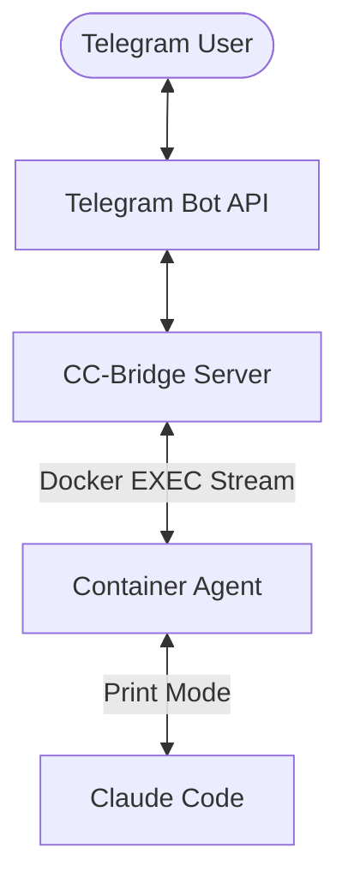

# Docker Integration for CC-Bridge

CC-Bridge provides first-class support for Claude Code running inside Docker containers. This integration provides a sandboxed environment with full tool permissions while maintaining a seamless link to your local Telegram client.

## 1. Architecture: The EXEC Stream

Unlike traditional methods that rely on named pipes or shared files, CC-Bridge uses **Persistent Asynchronous EXEC Streams**.

### 1.1 How it Works

1. **Discovery**: CC-Bridge scans for containers with the label `cc-bridge.instance=claude`.
2. **Bridge Agent**: It spawns a lightweight `cc_bridge.agents.container_agent` inside the container using `docker exec`.
3. **Communication**: A bidirectional I/O stream is established between the host bridge and the container agent.
4. **Tool Execution**: The agent handles command translation and ensures Claude's outputs are chunked and relayed back to the host in near real-time.



## 2. Recommended Setup (Docker Compose)

The easiest way to get started is using the provided [docker-compose.yml](file:///Users/robin/xprojects/cc-bridge/dockers/docker-compose.yml).

### 2.1 File Structure
```text
dockers/
├── Dockerfile           # Multi-stage build
├── docker-compose.yml   # Orchestration
├── .env                 # API Keys & Config
└── .claude/
    └── settings.json    # YOLO Mode permissions
```

### 2.3 Volume Mounting Strategy
To ensure a consistent experience, CC-Bridge uses a **Hybrid Volume Strategy**:
- **Metadata**: Files like `settings.json` and `.claude.json` are mounted individually from the repo for version control.
- **Plugins**: The host's `~/.claude/plugins` is mounted globally to ensure your installed plugins (and their cache) are synced between host and container.

## 3. Real YOLO Mode

To enable peak automation ("YOLO Mode") inside the container:

1. **Disable Interactive Prompts**: CC-Bridge automatically generates `.claude.json` with `"trusted": true`.
2. **Environment Flags**: In your `settings.json` (inside the container's `.claude/` folder), the following are enabled:
   - `CLAUDE_CODE_ALLOW_WEB_TOOLS=1`
   - `DISABLE_COST_WARNINGS=1`
   - `CLAUDE_CODE_DISABLE_FEEDBACK_SURVEY=1`
   - `alwaysThinkingEnabled: true`

## 4. Discovery & Management

CC-Bridge finds your container automatically via labels:

```bash
# Verify discovery
cc-bridge claude-list
```

If the container is recreated (e.g., after `docker compose up -d`), CC-Bridge detects the new container ID automatically and re-establishes the EXEC stream.

## 5. Manual Execution Helper

Use the built-in Makefile helper to talk directly to your container for testing:

```bash
make talk msg="What is your current directory?"
```

## 6. Troubleshooting

- **No Internet**: Ensure you have performed the one-time interactive setup to accept the terminal theme and security warnings: `docker exec -it claude-cc-bridge claude --allow-dangerously-skip-permissions`.
- **Instance Not Found**: Ensure your container has the label `cc-bridge.instance=claude`.
- **Plugin Mismatch**: Verify that `~/.claude/plugins` is accessible on your host machine.
