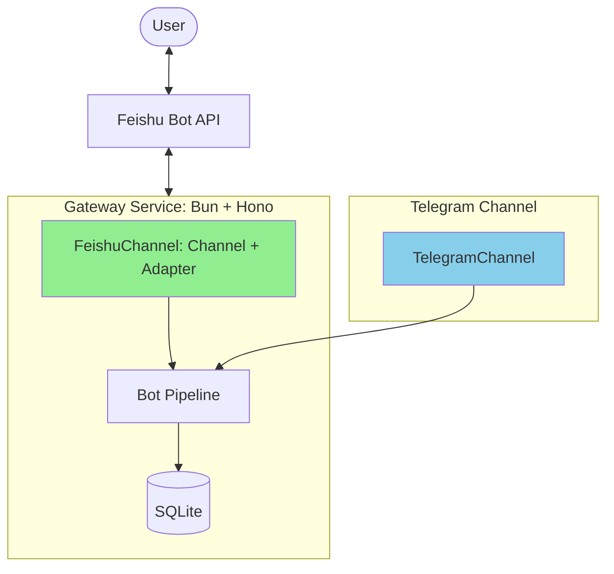
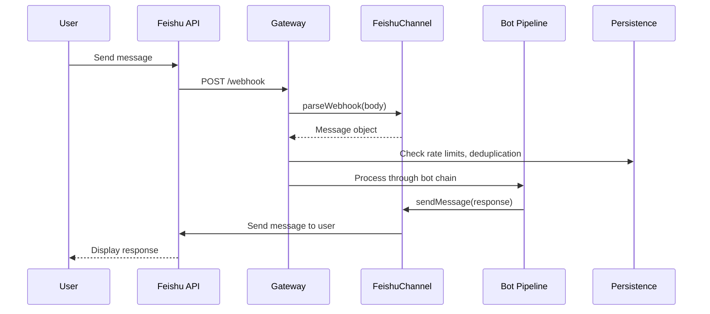

## 0156. add new channel for feishu

### Background

We need to add a new channel for Feishu (飞书/Lark) as a secondary channel for cc-bridge, similar to the existing Telegram channel. Feishu is a team collaboration platform used by enterprises for messaging, and integrating it will allow cc-bridge users to interact with Claude Code through Feishu bots.

**Reference materials:**
- [OpenClaw 最新保姆级飞书对接指南教程](https://www.cnblogs.com/catchadmin/p/19592309)
- OpenClaw reference implementation in `vendors/openclaw/extensions/feishu/`
- Existing Telegram channel implementation in `src/gateway/channels/telegram.ts`

### Requirements

**Functional Requirements:**
1. Create a new Feishu channel that implements the same `Channel` and `ChannelAdapter` interfaces as Telegram
2. Support Feishu bot webhook for receiving messages from Feishu
3. Support sending messages back to Feishu (text messages)
4. Support showing typing indicators
5. Support setting bot menu commands
6. Integrate with the existing bot pipeline (MenuBot, HostBot, AgentBot)
7. Support both Feishu (China) and Lark (International) domains

**Non-Functional Requirements:**
1. Follow the existing channel interface pattern for consistency
2. Reuse existing rate limiting, deduplication, and persistence mechanisms
3. Add proper error handling and logging
4. Support environment variable configuration for Feishu credentials
5. Add TypeScript types for Feishu-specific data structures
6. Write unit tests for the new channel

**Integration Points:**
1. Add environment variables for `FEISHU_APP_ID` and `FEISHU_APP_SECRET`
2. Add new webhook route `/webhook/feishu` or reuse existing `/webhook` with channel detection
3. Update constants to include Feishu API base URLs
4. Update gateway initialization to include Feishu channel
5. Update bot pipeline to work with both Telegram and Feishu channels

### Q&A

**Q: Should we create a separate webhook route for Feishu?**
A: No, we should extend the existing webhook route to support multiple channels. The webhook handler can detect the channel based on the request body structure or headers.

**Q: Should we support Feishu's WebSocket long-connection mode?**
A: For v1, we'll use webhook mode for simplicity. WebSocket support can be added later if needed.

**Q: How should we handle different message formats between Telegram and Feishu?**
A: The `ChannelAdapter.parseWebhook()` method already normalizes messages to our internal `Message` format. We'll implement Feishu-specific parsing logic there.

**Q: Should we support Feishu-specific features like rich cards?**
A: For v1, we'll focus on text messages. Rich card support can be added in a future iteration.

**Q: How do we handle Feishu vs Lark domains?**
A: We'll add a `FEISHU_DOMAIN` environment variable (default: `feishu`, options: `feishu`|`lark`) and use the appropriate API base URL.

### Design

#### Architecture Overview

The Feishu channel will follow the same architectural pattern as the existing Telegram channel:



#### Interface Implementation

**File: `/src/gateway/channels/feishu.ts`**

```typescript
// Feishu Channel implementing Channel and ChannelAdapter interfaces
export class FeishuChannel implements Channel, ChannelAdapter {
    name = "feishu";
    private client: FeishuClient;

    constructor(appId: string, appSecret: string, domain?: 'feishu' | 'lark') {
        this.client = new FeishuClient(appId, appSecret, domain);
    }

    // Channel interface methods
    async sendMessage(chatId: string, text: string, options?: unknown): Promise<void>;
    async showTyping(chatId: string): Promise<void>;

    // Feishu-specific methods
    async setMenu(commands: Command[]): Promise<void>;
    async getStatus(): Promise<unknown>;

    // ChannelAdapter interface methods
    parseWebhook(body: unknown): Message | null;
}

// Feishu API client
class FeishuClient {
    private appId: string;
    private appSecret: string;
    private domain: 'feishu' | 'lark';
    private accessToken: string | null;

    async sendMessage(chatId: string, text: string): Promise<void>;
    async sendChatAction(chatId: string): Promise<void>;
    async getTenantAccessToken(): Promise<string>;
}
```

#### Configuration

**Environment Variables (`.env.example`):**

```bash
# -----------------------------------------------------------------------------
# Feishu Bot Configuration
# -----------------------------------------------------------------------------

# Feishu App ID from Feishu Open Platform
# Example: cli_xxxxxxxxxxxxx
FEISHU_APP_ID=your_feishu_app_id_here

# Feishu App Secret from Feishu Open Platform
FEISHU_APP_SECRET=your_feishu_app_secret_here

# Feishu Domain: feishu (China) or lark (International)
# Default: feishu
#FEISHU_DOMAIN=feishu

# Optional: Feishu Encrypt Key for webhook verification
#FEISHU_ENCRYPT_KEY=your_encrypt_key_here

# Optional: Feishu Verification Token for webhook verification
#FEISHU_VERIFICATION_TOKEN=your_verification_token_here
```

**Constants Update (`src/gateway/consts.ts`):**

```typescript
DIAGNOSTICS: {
    URLS: {
        TELEGRAM_API_BASE: "https://api.telegram.org",
        FEISHU_API_BASE: "https://open.feishu.cn",
        LARK_API_BASE: "https://open.larksuite.com",
        ANTHROPIC_API_BASE: "https://api.anthropic.com",
    },
    // ... existing config
}
```

#### Data Flow

**Feishu Webhook Request Flow:**



#### Message Format Mapping

**Feishu Webhook Body → Internal Message:**

```typescript
// Feishu webhook structure
{
    "schema": "2.0",
    "header": {
        "event_id": "xxxxxxxx",
        "timestamp": "1234567890",
        "event_type": "im.message.receive_v1",
        "tenant_key": "xxxxxxxx",
        "app_id": "cli_xxxxxxxxx"
    },
    "event": {
        "sender": {
            "sender_id": {
                "open_id": "ou_xxxxxxxxx",
                "union_id": "on_xxxxxxxxx"
            },
            "sender_type": "user",
            "tenant_key": "xxxxxxxx"
        },
        "message": {
            "message_id": "om_xxxxxxxxx",
            "chat_id": "oc_xxxxxxxxx",
            "chat_type": "group",
            "content": "{\"text\":\"test\"}",
            "message_type": "text"
        }
    }
}

// Mapped to internal Message format
{
    channelId: "feishu",
    chatId: "oc_xxxxxxxxx",
    text: "test",
    updateId: "om_xxxxxxxxx", // Using message_id as update_id
    user: {
        id: "ou_xxxxxxxxx",
        username: undefined // Feishu doesn't expose username by default
    }
}
```

#### Bot Pipeline Integration

The existing bot pipeline (MenuBot, HostBot, AgentBot) already works with the `Channel` interface, so no changes are needed to the bot implementations. The gateway will:

1. Initialize both `TelegramChannel` and `FeishuChannel` instances
2. Create bot instances for each channel
3. Route webhook requests to the appropriate channel based on the request body

### Plan

#### Phase 1: Core Implementation (Priority: High)

**1.1 Create Feishu Client Class**
- Create `/src/gateway/channels/feishu.ts`
- Implement `FeishuClient` class with:
  - `getTenantAccessToken()` - Fetch Feishu API access token
  - `sendMessage()` - Send text messages to Feishu
  - `sendChatAction()` - Show typing indicator
  - `setCommands()` - Set bot menu commands
- Add error handling and retry logic

**1.2 Implement FeishuChannel Class**
- Implement `Channel` interface:
  - `sendMessage()` - Delegate to FeishuClient
  - `showTyping()` - Delegate to FeishuClient
- Implement `ChannelAdapter` interface:
  - `parseWebhook()` - Parse Feishu webhook body to Message format
- Add proper TypeScript types for Feishu API responses

**1.3 Update Configuration**
- Update `src/gateway/consts.ts` with Feishu API URLs
- Update `.env.example` with Feishu environment variables
- Add Feishu-specific configuration options

**1.4 Integrate with Gateway**
- Update `src/gateway/index.ts` to:
  - Load Feishu credentials from environment
  - Initialize FeishuChannel instance
  - Create bot instances for Feishu channel
  - Add Feishu to the channel registry

**1.5 Update Webhook Handler**
- Update `src/gateway/routes/webhook.ts` to:
  - Detect incoming webhook type (Telegram vs Feishu)
  - Route to appropriate channel adapter
  - Handle Feishu-specific verification

#### Phase 2: Testing & Validation (Priority: High)

**2.1 Unit Tests**
- Create `/src/gateway/tests/feishu.test.ts`
- Test FeishuClient methods
- Test FeishuChannel.parseWebhook()
- Test error handling

**2.2 Integration Tests**
- Test webhook routing
- Test bot pipeline integration
- Test persistence integration

**2.3 Manual Testing**
- Create test Feishu app
- Configure webhook
- Test message flow end-to-end

#### Phase 3: Documentation (Priority: Medium)

**3.1 Update Documentation**
- Update README.md with Feishu setup instructions
- Create Feishu setup guide
- Update architecture documentation

**3.2 Configuration Examples**
- Add sample .env entries
- Add example webhook configurations

#### Implementation Checklist

- [x] Create `/src/gateway/channels/feishu.ts`
- [x] Implement `FeishuClient` class
- [x] Implement `FeishuChannel` class
- [x] Update `/src/gateway/consts.ts`
- [x] Update `.env.example`
- [x] Update `/src/gateway/index.ts`
- [x] Update `/src/gateway/routes/webhook.ts`
- [x] Create `/src/gateway/tests/feishu.test.ts`
- [x] Update README.md
- [x] Create Feishu setup guide
- [x] Test webhook routing
- [ ] Test end-to-end message flow

### Artifacts

| Type | Path | Generated By | Date |
|------|------|--------------|------|
| Channel Implementation | `/src/gateway/channels/feishu.ts` | super-coder | 2026-02-08 |
| Unit Tests | `/src/gateway/tests/feishu.test.ts` | super-coder | 2026-02-08 |
| Webhook Routing Tests | `/src/gateway/tests/webhook-routing.test.ts` | super-coder | 2026-02-08 |
| Gateway Init Tests | `/src/gateway/tests/gateway-init.test.ts` | super-coder | 2026-02-08 |
| Constants Tests | `/src/gateway/tests/consts.test.ts` | super-coder | 2026-02-08 |
| Channels Index Tests | `/src/gateway/tests/channels-index.test.ts` | super-coder | 2026-02-08 |
| Updated Constants | `/src/gateway/consts.ts` | super-coder | 2026-02-08 |
| Updated Env Example | `.env.example` | super-coder | 2026-02-08 |
| Updated Gateway Index | `/src/gateway/index.ts` | super-coder | 2026-02-08 |
| Updated Webhook Handler | `/src/gateway/routes/webhook.ts` | super-coder | 2026-02-08 |
| Setup Documentation | `/docs/feishu-setup.md` | super-coder | 2026-02-08 |

### Implementation Summary

**Completed Tasks:**

1. **Feishu Channel Implementation** (`/src/gateway/channels/feishu.ts`)
   - `FeishuClient` class with token management and API calls
   - `FeishuChannel` class implementing `Channel` and `ChannelAdapter` interfaces
   - Support for both Feishu (China) and Lark (International) domains
   - Token caching with 1-hour TTL
   - Proper error handling and logging

2. **Configuration Updates**
   - Added Feishu API URLs to constants
   - Added environment variables for Feishu credentials
   - Optional encryption and verification token support

3. **Gateway Integration**
   - Feishu channel initialization with conditional loading
   - Bot pipeline integration (MenuBot, HostBot, AgentBot)
   - Webhook routing with automatic channel detection

4. **Webhook Handler Updates**
   - Channel detection based on request body structure
   - Support for both Telegram and Feishu webhooks on `/webhook` endpoint
   - Graceful handling when Feishu is not configured

5. **Unit Tests**
   - Comprehensive test coverage for FeishuChannel
   - Tests for webhook parsing, message sending, error handling
   - Domain configuration tests
   - **NEW: Webhook routing tests** (`/src/gateway/tests/webhook-routing.test.ts`)
     - Channel detection from request body (Telegram vs Feishu)
     - Webhook routing logic with proper channel selection
     - Edge cases: missing channel, invalid format, unknown body
     - Rate limiting and deduplication
     - Error handling and bot failures
   - **NEW: Gateway initialization tests** (`/src/gateway/tests/gateway-init.test.ts`)
     - Feishu channel initialization with environment variables
     - Bot pipeline creation for both channels
     - Menu setup and configuration
     - Edge cases: empty credentials, invalid domain values
   - **NEW: Constants tests** (`/src/gateway/tests/consts.test.ts`)
     - Feishu/Lark API base URLs verification
     - HTTPS requirement validation
     - URL structure and format validation
   - **NEW: Channels index tests** (`/src/gateway/tests/channels-index.test.ts`)
     - Export verification for all channel types
     - Interface implementation validation
     - Polymorphic channel usage patterns

6. **Documentation**
   - Complete Feishu setup guide
   - Environment variable documentation
   - Troubleshooting section

**Key Design Decisions:**

1. **Unified Webhook Endpoint**: Extended existing `/webhook` route to handle multiple channels based on request body detection
2. **Channel-Agnostic Bot Pipeline**: Bots work with any channel implementing the `Channel` interface
3. **Conditional Feishu Loading**: Feishu channel is only initialized when credentials are provided
4. **Token Caching**: Implemented 1-hour token cache with 5-minute expiration buffer
5. **Graceful Degradation**: System continues to work when Feishu is not configured

**Next Steps (Manual Testing Required):**

1. Create a Feishu/Lark developer app
2. Configure webhook URL to point to your cc-bridge instance
3. Set environment variables (`FEISHU_APP_ID`, `FEISHU_APP_SECRET`)
4. Test end-to-end message flow
5. Verify bot commands work through Feishu

### References

- [OpenClaw 最新保姆级飞书对接指南教程 搭建属于你的 AI 助手](https://www.cnblogs.com/catchadmin/p/19592309)
- [OpenClaw Feishu Extension](vendors/openclaw/extensions/feishu/)
- [Feishu Open Platform Documentation](https://open.feishu.cn/document)
- [Lark API Documentation](https://open.larksuite.com/document)
- Existing Telegram Channel: `/src/gateway/channels/telegram.ts`
- Channel Interface: `/src/gateway/channels/index.ts`
- cc-bridge Architecture Spec: `/docs/ARCHITECTURE_SPEC.md`
